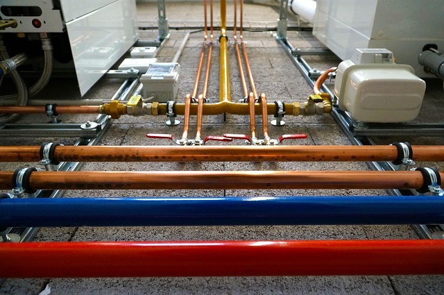
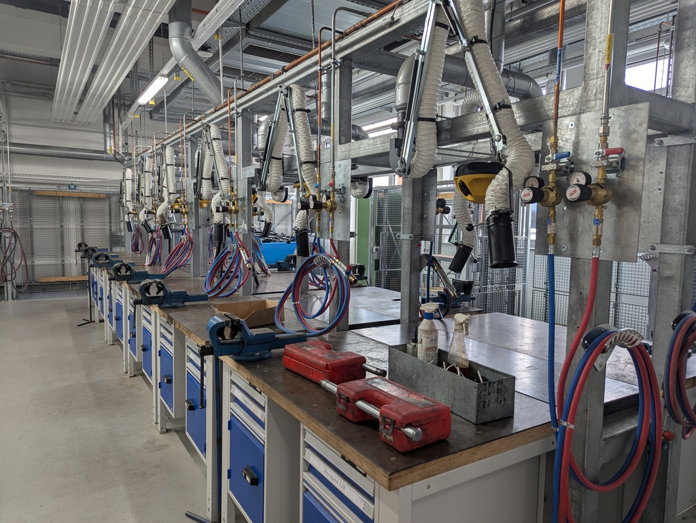
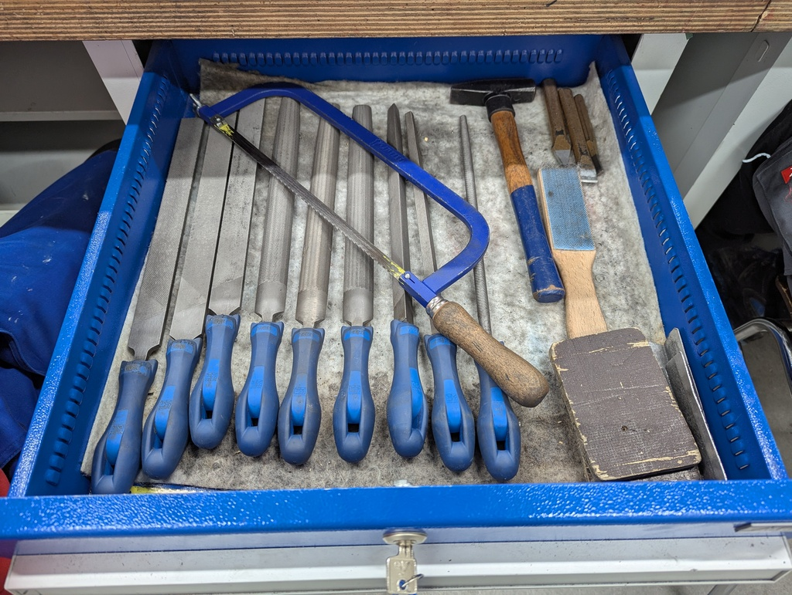
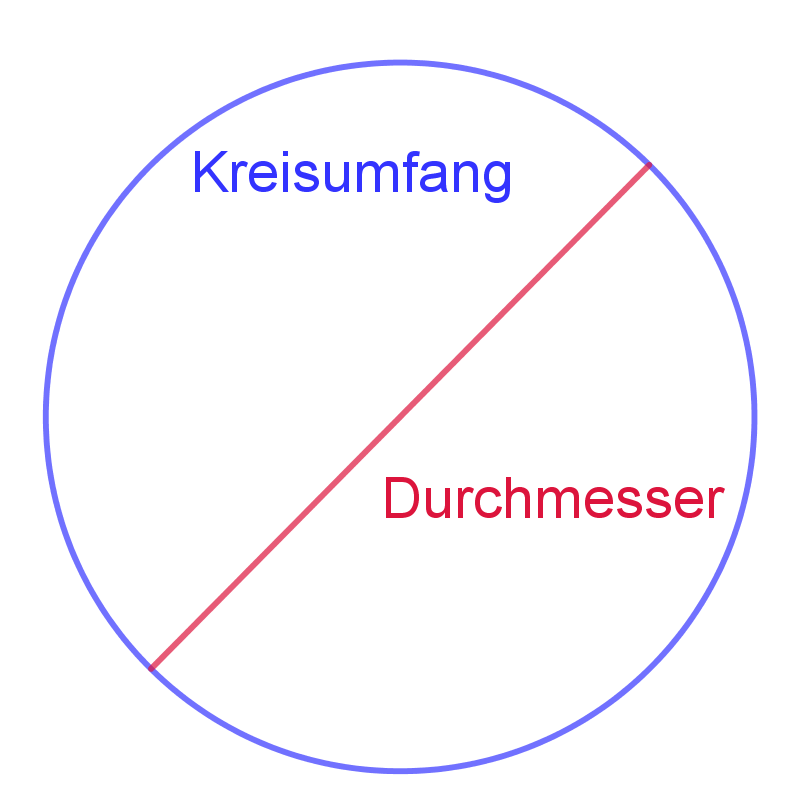

<!--

author:   Hilke Domsch

email:    hilke.domsch@gkz-ev.de

version:  0.1.1

language: de

narrator: Deutsch Male

comment:  Grundkurs Anlagenmechaniker 1

edit: true

date: 2025-07-21

logo: ../assets/img/heizungsrohre.jpg
icon: ../assets/img/Logo_234px.png

import: https://raw.githubusercontent.com/Ifi-DiAgnostiK-Project/Piktogramme/refs/heads/main/makros.md
import: https://raw.githubusercontent.com/Ifi-DiAgnostiK-Project/LiaScript_DragAndDrop_Template/refs/heads/main/README.md
import: https://raw.githubusercontent.com/Ifi-DiAgnostiK-Project/LiaScript_ImageQuiz/refs/heads/main/README.md

title: Grundkurs SHK-Anlagenmechaniker G-IH 1

tags:  SHK,
       Grundkurs,
       Anlagenmechaniker

@style
.flex-container {
    display: flex;
    flex-wrap: wrap; /* Allows the items to wrap as needed */
    align-items: stretch;
    gap: 20px; /* Adds both horizontal and vertical spacing between items */
}

.flex-child {
    flex: 1;
    margin-right: 20px; /* Adds space between the columns */
}

@media (max-width: 600px) {
    .flex-child {
        flex: 100%; /* Makes the child divs take up the full width on slim devices */
        margin-right: 0; /* Removes the right margin */
    }
}
@end

-->

# Grundkurs SHK-Anlagenmechaniker G-IH 1

Bearbeitungsverfahren fachbezogener Rohrwerkstoffe
===

<section class="flex-container" style="padding: 1rem;">

 <!-- style="height: 300px" -->

 <!-- style="height: 300px" -->

</section>

_Quellen:_
_Bild links: Pixabay; Bild rechts: GKZ_

## Überprüfungsaufgaben

<!--style="color: grey; font-size: large"-->Sie haben in den letzten Tagen Werkzeuge und Grundhandgriffe in der Bearbeitung von Rohrwerkstoffen kennengelernt und eingeübt.   Mit den folgenden Fragen können Sie Ihr erworbenes Wissen überprüfen.

<!--style="color:red; font-weight: bolder;"-->Hinweis: Es können mehrere Antworten richtig sein.

------------------

<!-- style="width: 700px" -->

_Quelle: HWK Dresden, Florian Riefling_

----------

<!--style="color:blue; font-weight: bolder; font-size: large"-->Viel Erfolg!

## 1. Was bedeutet der Arbeitsgang "schlichten"?

<!--style="color:blue; font-weight: bolder"-->Ziehen Sie die richtigen Begriffe in das Antwortfeld.

----------------------

<!-- data-randomize -->
@dragdropmultiple(@uid,geringere Materialabtragung|Feinbearbeitung|Maßgenauigkeit herstellen|geforderte Oberflächengüte,Streit schlichten|Material nach Qualität sortieren|Werkzeug saubermachen)

## 2. Die Hiebnummern

><!--style="color: red; font-weight: bolder"-->Es sind insgesamt vier Antworten richtig!

<section class="flex-container border">

<!--style="color:blue; font-weight: bolder"-->Die Hiebnummern H1, H2 und H3 bei der Feile stehen für:

<!-- data-randomize -->
- [[X]] Die Hiebnummer H1 bezeichnet eine grobe Feile.
- [[ ]] Die Angaben H1 bis H3 geben an, wie viel mm Material abzutragen ist.
- [[X]] Mit H2 wird auch eine Halbschlichtfeile bezeichnet.
- [[ ]] Die Hiebnummern geben an, wie viel Hiebe zum Materialabtrag nötig sind.
- [[ ]] Die Kürzel H1, H2 und H3 stehen für die Vornamen der drei Erfinderbrüder: Hans, Heinrich und Hugo Hieb.
- [[X]] H3 steht für Schlicht-Feilen.
- [[X]] Je höher die Zahl nach dem "H", desto feiner der Hieb.

</section>

## 3. Die Abwicklung eines Werkstücks

<!--style="color:blue; font-weight: bolder"-->Die Abwicklung eines Werkstücks beschreibt...

<!-- data-randomize -->
- [[X]] die entfaltete Darstellung eines Werkstücks.
- [[ ]] einen Entsorgungsvorgang.
- [[X]] die Seitendarstellung eines Werkstücks.
- [[ ]] eine Zusammenstellung von mehreren Werkstücken.

## 4. Bohren

<!--style="color:blue; font-weight: bolder"-->Für ein Gewinde M10 ist welches Loch vorzubohren?

<!-- data-randomize -->
- [(X)] Ø 8,5 mm, da M10 eine Steigung von 1,5 mm hat
- [( )] Ø 10 mm, da Angabe M10
- [( )] Ø 11,5 mm, da M10 eine Steigung von 1,5 mm hat

## 5. Das Z-Maß

<!--style="color:blue; font-weight: bolder"-->Vervollständigen Sie die Sätze.

Das z<!--style="color:orange;"-->-<!--style="color:orange;"-->Maß<!--style="color:orange;"--> wird auch als [[ Einbaumitte   |  Einbaum  | (Einbaumaß)]] bezeichnet.

Es ist der [[ kleinste | (mittlere)   |  größte ]] Abstand zwischen dem eingebaute Rohrende und der Achse des [[ Fichtenings | (Fittings)   |  Frittings ]] oder den Enden von zwei eingebauten Rohren.

Die z<!--style="color:orange;"-->-<!--style="color:orange;"-->Maße<!--style="color:orange;"--> sind aus den [[ Zeichnungen   |  Stücklisten  | (Baulängen)]] abzüglich der mittleren [[ Einschublängen | (Einschraublängen)   |  Einbaulängen ]] zu berechnen.

Das z<!--style="color:orange;"-->-<!--style="color:orange;"-->Maß<!--style="color:orange;"--> und ein [[ gutes Lagersystem   |  gutes Miteinander  | (einheitliches Messverfahren)]] sind der Kern der Montage-Methode von Georg Fischer.

Das z<!--style="color:orange;"-->-<!--style="color:orange;"-->Maß<!--style="color:orange;"--> ist das [[ Einbaumaß | ("Konstruktionsmaß")   |  Zeitmaß ]] des Installateurs.

-----------------------

<!--style="color:blue; font-weight: bolder"-->Grundlage für die Bestimmung und Anwendung des z-Maßes bildet der Grundsatz:

<!-- data-randomize -->
- [( )] einheitliches Messen - Mitte - Rand - Mitte = M
- [(X)] einheitliches Messen - Mitte - Mitte = M

-------------------------

<!--style="color:blue; font-weight: bolder"-->Die z-Maß-Methode bedingt:

<!-- data-randomize -->
- [[X]] genaue Abklärung der Leitungsführung
- [[ ]] Kenntnis der Baumaße des Gebäudes
- [[X]] normgerechte Rohrgewinde
- [[ ]] einschlägige Rechenprogramme für die notwendigen Berechnungen
- [[X]] einheitliches Messverfahren

## 6. Gestreckte Längen berechnen

<!--style="font-size: large;font-weight: bold"-->Zur Erinnerung:

Zwischen dem Durchmesser<!-- style="color: red" --> ${d}$<!-- style="color: red" --> und dem Umfang<!-- style="color: blue" --> $l_{U}$<!-- style="color: blue" --> besteht ein festes Zahlenverhältnis, die Kreiszahl $\pi$.

$\pi$ $\text{=}$ $3,14$

><!--style="font-size: large;font-weight: bold"-->$\frac{l_{U}}{d}$ $\text{=}$ $\pi$ $\implies$ $l_{U}$ $\text{=}$ ${d}$ $\cdot$ $\pi$

<!-- style="width: 350px;" -->

_Quelle: https://lernarchiv.bildung.hessen.de/sek/mathematik/geometrie/kreis/kreiszahl_pi/lernpfad_pi/index.html _

-------------

<!--style="color:blue; font-weight: bolder"-->Was beschreibt die gestreckte Länge eines Rohrs?

<!-- data-randomize -->
- [( )] Die gebogene Länge nach dem Einbau
- [(X)] Die benötigte Materiallänge vor dem Einbau
- [( )] Den Außendurchmesser
- [( )] Die Wandstärke

### Teilaufgaben 1

Die gestreckte<!--style="font-weight: bold"--> Länge<!--style="font-weight: bold"--> ist die Summer aller

<!-- data-randomize -->
- [(X)] geraden und gebogenen Abschnitte
- [( )] geraden Abschnitte
- [( )] Kreisbögen

Die gestreckte<!--style="font-weight: bold"--> Länge<!--style="font-weight: bold"--> ist

<!-- data-randomize -->
- [(X)] die Länge der neutralen Faser
- [( )] die Länge der gestauchten Faser
- [( )] die Länge der gestreckten Faser

Gebogene<!--style="font-weight: bold"--> Rohrsegmente<!--style="font-weight: bold"--> werden mit dieser Formel berechnet:

<!-- data-randomize -->
- [( )] $l_{b}$<!-- style="color: orange" --> $\text{=}$ $\frac{{Umfang}}{2}$<!--style="font-size: large;font-weight: bold"-->
- [( )] $l_{b}$<!-- style="color: orange" --> $\text{=}$ $\pi$ $\cdot$ ${d}$
- [(X)] $l_{b}$<!-- style="color: orange" --> $\text{=}$ $\frac{\pi {\cdot} {d} {\cdot} {\alpha}}{360}$<!--style="font-size: large;font-weight: bold"-->

Die neutrale<!--style="font-weight: bold"--> Faser<!--style="font-weight: bold"--> verändert sich beim Biegen

<!-- data-randomize -->
- [(X)] weder durch Zug noch durch Druck
- [( )] durch Zug oder durch Druck
- [( )] im Wert von $\pi$

### Teilaufgaben 2

Die gestreckte Länge eines Fallrohrs Ø ${100}$ $\text{mm}$ soll berechnet werden.

1. Gerader Abschnitt: ${600}$ $\text{mm}$ $\text{=}$ $l_{1}$<!-- style="color: orange" -->

2. Gebogener Abschnitt: $\text{90°-Bogen}$ $\text{=}$ $l_{2}$<!-- style="color: orange" -->

<section class="flex-container border">

<!--style="color:blue; font-weight: bolder"-->Wie lang muss das Ausgangsrohr **mindestens** sein, damit es nach dem Biegen passt?

$l_{1}$ $\text{=}$ [[  600  ]] $\text{mm}$

</section>

<section class="flex-container border">

Für die Berechnung des gebogenen Abschnitts benötigst du eine Formel. Wähle die richtige Formel aus:

<!-- data-randomize -->
- [( )] $l_{2}$<!-- style="color: orange" --> $\text{=}$ $\frac{{Umfang}}{2}$<!--style="font-size: large;font-weight: bold"-->
- [( )] $l_{2}$<!-- style="color: orange" --> $\text{=}$ $\pi$ $\cdot$ ${d}$
- [(X)] $l_{2}$<!-- style="color: orange" --> $\text{=}$ $\frac{\pi {\cdot} {d} {\cdot} {\alpha}}{360}$<!--style="font-size: large;font-weight: bold"-->

<!--style="font-size: large"-->Setze in die Formel alle Daten richtig ein.

Die Länge $l_{2}$ beträgt [[  78,5  ]] $\text{mm}$
****************************************

Lösung: Berechnung der Bogenlänge $l_2$
===

Gegeben:

- Durchmesser: $d = 100\,\text{mm}$
- Winkel: $\alpha = 90^\circ$

Gesucht ist die Bogenlänge $l_2$.

---

**1. Formel**
===

$l_2 = \frac{\pi \cdot d \cdot \alpha}{360}$

Diese Formel basiert auf der allgemeinen Bogenlänge:

$l = 2\pi r \cdot \frac{\alpha}{360}$

Da $d = 2r$, folgt:

$l = \pi d \cdot \frac{\alpha}{360}$

---

**2. Werte einsetzen**
===

$l_2 = \frac{\pi \cdot 100\,\text{mm} \cdot 90}{360}$

---

**3. Vereinfachen**
===

$\frac{90}{360} = \frac{1}{4}$

$l_2 = \pi \cdot 100\,\text{mm} \cdot \frac{1}{4}$

---

**4. Weiter vereinfachen**
===

$l_2 = \pi \cdot 25\,\text{mm}$

---

**5. Numerisches Ergebnis**
===

$l_2 \approx 3{,}1416 \cdot 25\,\text{mm}$

$l_2 \approx 78{,}54\,\text{mm}$

---

**Ergebnis**
===

$\boxed{l_2 \approx 78{,}5\,\text{mm}}$

****************************************

</section>

<section class="flex-container border">

<!--style="font-size: large"-->Jetzt rechne die Gesamtlänge aus:

$l_{1}$ $\text{=}$ [[  600  ]] $\text{mm}$ $\text{+}$ $l_{2}$  [[  78,5  ]] $\text{mm}$ $\text{=}$ [[  678,5  ]] $\text{mm}$
****************************************
Lösung: Gesamtlänge berechnen
===

$l_1 = 600\,\text{mm}$
$l_2 \approx 78{,}5\,\text{mm}$

Einsetzen
===

$l_{gesamt} = l_1 + l_2$

$l_{gesamt} = 600\,\text{mm} + 78{,}5\,\text{mm}$

$l_{gesamt} = 678{,}5\,\text{mm}$

****************************************

</section>

## Super gemacht 👌

<!-- style="width: 700px" -->

_Quelle: Pixabay, geralt_

