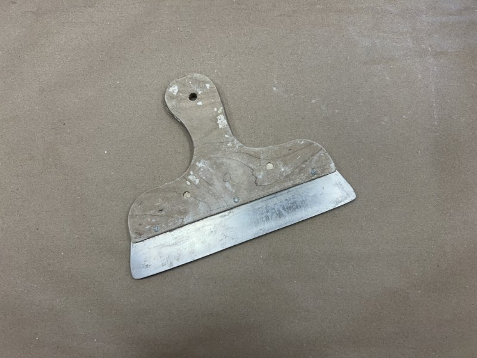
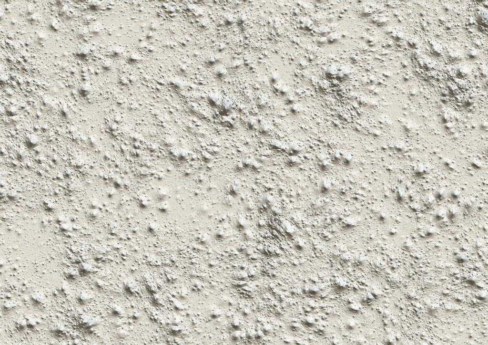
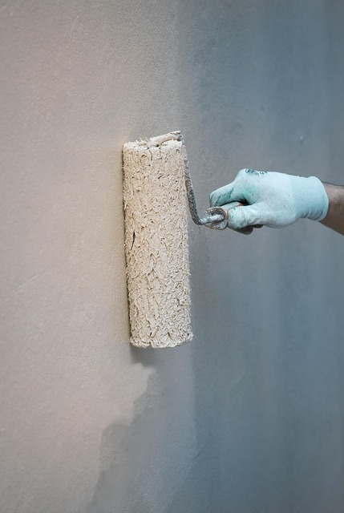

<!--

author:    Hilke Domsch
email:     hilke.domsch@gkz-ev.de
version:   0.0.11

language:  de
narrator:  Deutsch Male

edit:      true
date:      2025-08-01

title:     Grundkurs Maler/Lackierer G-ML-24
comment:   Grundkurs Maler/Lackierer

tags:      Maler,
           Grundkurs

icon:      ../assets/img/Logo_234px.png
logo:      ../assets/img/farben.jpg

attribute: Title Image by Pixabay, Darkmoon Art

link: ./style.css
import:    https://raw.githubusercontent.com/Ifi-DiAgnostiK-Project/LiaScript_DragAndDrop_Template/refs/heads/main/README.md
           https://raw.githubusercontent.com/Ifi-DiAgnostiK-Project/Piktogramme/refs/heads/main/makros.md
           https://raw.githubusercontent.com/Ifi-DiAgnostiK-Project/LiaScript_ImageQuiz/refs/heads/main/README.md
           https://raw.githubusercontent.com/Ifi-DiAgnostiK-Project/Bildersammlung/refs/heads/main/makros.md

-->

# Grundstufe Maler- und Lackiererhandwerk G-ML-24  🧑‍🎨

Sie haben in den letzten Tagen Werkzeuge und Grundhandgriffe im Maler- und Lackiererhandwerk kennengelernt und eingeübt.     __Überprüfen Sie Ihr Wissen.__

<!-- class="highlight" -->
Wir wünschen Ihnen viel Erfolg beim Beantworten der Fragen!

   

@Maler_Planung.Uebung3_Ergebnis(55)  _Quelle aller Bilder: HWK Dresden, Florian Riefling_

## Typische Werkzeuge im Maler- und Lackiererhandwerk I

><!--style="color: red; font-weight: bolder"-->Es sind insgesamt vier Antworten richtig!

<section class="flex-container border">

<!-- class="highlight" -->
Wie nennt man dieses Werkzeug?
------------------------------

<!-- data-randomize -->
- [[ ]] Kamm
- [[X]] Abreißblech
- [[X]] Rakel
- [[X]] Schwedenblech
- [[ ]] Blockschiene
- [[X]] Flächenrakel

<!-- style="width: 350px" -->

</section>

## Typische Werkzeuge im Maler- und Lackiererhandwerk II

<section class="flex-container border">

<!-- class="highlight" -->
Wie nennt man dieses Werkzeug?
------------------------------

<!-- data-randomize -->
- [( )] Kehrbesen
- [( )] Wandbürste
- [(X)] Tapezierbürste

<!-- style="width: 250px" -->

</section>

## Typische Werkzeuge im Maler- und Lackiererhandwerk III

<section class="flex-container border">

<!-- class="highlight" -->
Wie nennt man dieses Werkzeug?
------------------------------

<!-- data-randomize -->
- [( )] Ringpinsel
- [( )] Heizkörperpinsel
- [(X)] Schrägstrichzieher

<!-- style="width: 350px" -->

</section>

## Wichtige Arbeitsabläufe für allgemeine Decken- und Wandgestaltungen

Sie sollen in einem Raum Decken und Wände gestalten. -- In welcher Reihenfolge führen Sie diesen Auftrag aus?

<section class="flex-container border">

<!-- class="highlight"-->
Ziehen Sie die einzelnen Arbeitsschritte in die richtige Reihenfolge.\
An oberster Stelle steht der erste Arbeitsschritt.

<!-- data-randomize -->
@dragdroporder(@uid,Anschlussflächen abdecken und abkleben wie Türen - Fenster - Fußboden| Nicht tragfähige Beschichtung und Beläge von den Wand- und Deckenflächen entfernen.|Wand- und Deckenflächen nachwaschen.|Wand- und Deckenflächen spachteln.|Wand- und Deckenflächen schleifen und entstauben.|Wand- und Deckenflächen mit unpigmentierter sowie wasserverdünnter Grundbeschichtung grundieren.|Tapezieren von Raufaser an der Deckenfläche.|Makulatur oder Glattvlies kleben.|Decken- und Wandanschlüsse beschneiden und Zwischenbeschichtung applizieren.|Decken- und Wandanschlüsse beschneiden und Schlussbeschichtung applizieren.)

 
 
 
 
 
 
 
 

")<!-- style="width: 500px" -->

</section>

## Wichtige Arbeitsabläufe für Gestaltungsflächen -  Wände

Sie sollen in einem Raum Wände und Sockel gestalten. -- In welcher Reihenfolge führen Sie diesen Auftrag aus?

<!--style="color: green"-->Aufgabe 1: Wände

<section class="flex-container border">

<!-- class="highlight"-->
Ziehen Sie die einzelnen Arbeitsschritte in die richtige Reihenfolge.\
An oberster Stelle steht der erste Arbeitsschritt.

<!-- data-randomize -->
@dragdroporder(@uid,Gestaltungswand: Flächengliederung abmessen und anzeichnen.|Farbflächen mit Strichzieher und Lineal beschneiden.|Farbflächen mit Pinsel deckend farbig auslegen.|Radius auf der rechten Seite anzeichnen und deckend farbig auslegen.|Kontrastlinien mit Lineal und Strichzieher ziehen.|Wickeltechnik über die gesamte Gestaltung mit Latexbindemittel -glänzend- ausführen.)

 
 
 
 

")<!-- style="width: 500px" -->

</section>

## Wichtige Arbeitsabläufe für Gestaltungsflächen - Sockel

Sie sollen in einem Raum Wände und Sockel gestalten. -- In welcher Reihenfolge führen Sie diesen Auftrag aus?

<!--style="color: green"-->Aufgabe 2: Sockel

<section class="flex-container border">

<!-- class="highlight"-->
Ziehen Sie die einzelnen Arbeitsschritte in die richtige Reihenfolge.\
An oberster Stelle steht der erste Arbeitsschritt.

<!-- data-randomize -->
@dragdroporder(@uid,Sockelfläche einmessen und abkleben/abdecken.|Wickeltechnik zweifarbig im Sockelbereich ausführen.|Fläche der Wickeltechnik mit Strichzieher und Lineal einrahmen.|Abklebung und Abdeckung entfernen. Abfälle sachgerecht entsorgen und Werkzeuge und Arbeitsmittel reinigen.)

 
 

")<!-- style="width: 500px" -->

</section>

### Beschaffenheit von Untergründen

><!--style="color: red; font-weight: bolder"-->Es sind insgesamt fünf Antworten richtig!

<section class="flex-container border">

<!-- class="highlight" -->
Wie sollte ein Untergrund beschaffen sein, damit dieser beschichtet oder tapeziert werden kann?

<!-- data-randomize -->
- [[X]] sauber
- [[X]] trocken
- [[X]] tragfähig
- [[X]] frei von trennenden Substanzen
- [[X]] gleichmäßig saugfähig
- [[ ]] Haarrisse sind unerheblich
- [[ ]] leicht angeraute Unterfläche, damit es besser haftet
- [[ ]] leicht angefeuchtet, damit das Auftragen leichter geht

@Maler_Taetigkeiten.Koje_Vorbereitung(35)

</section>

### Haftfestigkeit alter Anstriche

><!--style="color: red; font-weight: bolder"-->Es sind insgesamt vier Antworten richtig!

<section class="flex-container border">

<!-- class="highlight" -->
Mit welchen Methoden kann die Haftfestigkeit alter Anstriche geprüft werden?

<!-- data-randomize -->
- [[X]] Abriebprobe/Wischprobe mit der Hand oder einem Tuch
- [[ ]] Abkärchern
- [[X]] Kratzprobe mit dem Spachtel
- [[X]] Tragfähigkeitsprüfung mit Klebebandtest
- [[ ]] Besprühen der Wand mit Parfüm oder Duftstoffen
- [[X]] Abklopfen mit dem Finger
- [[ ]] Farbauftragstest

<!-- style="max-width: 250px; width: 100%" -->

</section>

### Saugfähigkeit eines Untergrundes

<section class="flex-container border">

<!-- class="highlight" -->
Wie prüft man am besten die Saugfähigkeit eines Untergrunds?

<!-- data-randomize -->
- [(X)] Benetzungsprobe mit Wasser
- [( )] Farbauftragstest
- [( )] Kratzprobe mit Messer
- [( )] Klopfprobe

<!-- style="max-width: 350px; width: 100%" -->

</section>

### Feuchtigkeitsmessung

><!--style="color: red; font-weight: bolder"-->Es sind insgesamt vier Antworten richtig!

<section class="flex-container border">

<!-- class="highlight" -->
Wann ist eine Feuchtigkeitsprüfung sinnvoll?

<!-- data-randomize -->
- [[X]] bei sichtbarem oder vermuteten Schimmelbefall
- [[X]] bei sichtbaren oder vermuteten Wasserschäden
- [[X]] wenn dunkle Flecken an den Wänden sichtbar sind
- [[ ]] Die Prüfung der Feuchte ersetzt immer die Kontrolle von Rissen, Staub und Tragfähigkeit.
- [[ ]] immer - auch wenn die Umgebung trocken ist
- [[ ]] Eine Feuchtigkeitsprüfung ist zugleich eine Temperaturmessung und daher immer sinnvoll.
- [[X]] Eine Feuchtigkeitsprüfung geht jedem Farbanstrich voraus, um die Haftfestigkeit zu prüfen.

<!-- style="max-width: 350px; width: 100%" -->

</section>

### Prüfgeräte für Untergrundprüfungen

><!--style="color: red; font-weight: bolder"-->Es sind insgesamt drei Antworten richtig!

<section class="flex-container border">

<!-- class="highlight" -->
Welche Prüfgeräte oder Hilfsmittel werden häufig bei Untergrundprüfungen im Malerhandwerk eingesetzt?

<!-- data-randomize -->
- [[ ]] Rückprallbolzen
- [[ ]] Haftmessgerät
- [[ ]] Lupe
- [[X]] Hydrometer
- [[X]] Gitterschnitt
- [[X]] Schichtdickenmessgerät (Lack)

 
 

")<!-- style="max-width: 400px; width: 100%" -->

</section>

## Geschafft 🎉

