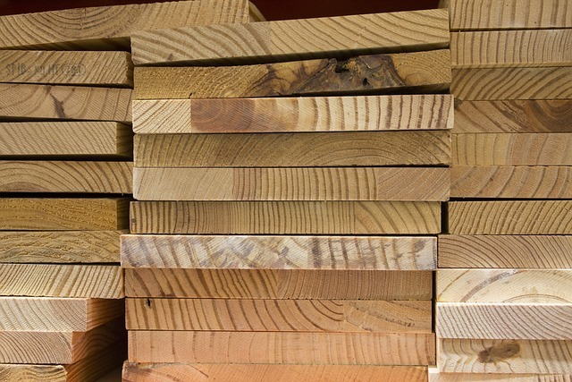

<!--
author:   Jan Franke; Volker Göhler; Hilke Domsch

email:    jan.franke@hwk-dresden.de; volker.goehler@informatik.tu-freiberg.de; hilke.domsch@gkz-ev.de

version:  0.0.8

language: de

narrator: Deutsch Female

edit: true
date: 2025-07-29
icon: ../assets/img/Logo_234px.png
logo: https://upload.wikimedia.org/wikipedia/commons/5/59/Dry_wood_texture.jpg
attribute: Title Image by Martin Vorel, CC BY-SA 4.0 <https://creativecommons.org/licenses/by-sa/4.0>, via Wikimedia Commons

comment:  Quiz zu Eigenschaften von Holz -- Teil 1

link: https://raw.githubusercontent.com/Ifi-DiAgnostiK-Project/LiaScript-Courses/refs/heads/main/courses/style.css

import: https://raw.githubusercontent.com/Ifi-DiAgnostiK-Project/LiaScript_DragAndDrop_Template/refs/heads/main/README.md
        https://raw.githubusercontent.com/Ifi-DiAgnostiK-Project/Piktogramme/refs/heads/main/makros.md
        https://raw.githubusercontent.com/Ifi-DiAgnostiK-Project/LiaScript_ImageQuiz/refs/heads/main/README.md
        https://raw.githubusercontent.com/Ifi-DiAgnostiK-Project/Holzarten/refs/heads/main/makros.md

title: Holzarten I

tags:  Tischler,
       Holzarten

@style
.lia-table__data {
    overflow: hidden;
    padding: 0.5rem;
}

.choice-selected {
    padding: 10px !important;
    border-radius: 4px !important;
    border: 2px solid rgb(var(--color-highlight));
}

.choices-container img {
    padding: 5px;
    height: auto;
    border-radius: 4px;
    margin: 0 auto;
    user-select: none;
    cursor: pointer;
}
@end

-->

## Überprüfen Sie Ihr Wissen zu den Holzarten I

Teil 1
=======

_Quelle: Pixabay, antmoreton_

# Welche Holzart erkennen Sie?

_Quelle aller Holz-Abbildungen:_ _https://holzvomfach.de/fachwissen-holz/holz-abc/ bzw. HWK Dresden, Florian Riefling_

<!--style="color:red; font-size: huge"-->Hinweis: Es können mehrere Antworten richtig sein!

--------------------------------

<section class="flex-container" style="padding: 1rem;">

<!-- data-randomize -->
- [(X)] Ahorn
- [( )] Fichte
- [( )] Kiefer
- [( )] Zeder

@Hoelzer1.Ahorn(15)

</section>

------------------------

<section class="flex-container" style="padding: 1rem;">

<!-- data-randomize -->
- [( )] Ahorn
- [(x)] Birke
- [( )] Rüster
- [( )] Lärche

@Hoelzer1.Birke(15)

</section>

------------------------------

<section class="flex-container" style="padding: 1rem;">

<!-- data-randomize -->
- [[x]] Pappel
- [[x]] Espe
- [[ ]] Ahorn
- [[x]] Aspe

@Hoelzer1.Pappel(15)

</section>

## Füllen Sie den Lückentext aus

<!--data-randomize -->
Eiche<!--style="font-weight: bolder;color: green"  --> ist ein sehr widerstandsfähiges Holz und lässt sich daher sehr gut für [[ Tasteninstrumente | (Außenbereiche) | Brandschutzverkleidungen]] verwenden.

<!--data-randomize -->
Lärche<!--style="font-weight: bolder;color: green"  --> ist aufgrund seiner [[ groben Holzstruktur |   Astfreiheit   | (hohen Harzhaltigkeit) ]] für Außenverkleidungen sehr gut geeignet.

<!--data-randomize -->
Ahorn<!--style="font-weight: bolder;color: green"  -->  ist wegen  [[ seines breiten Wuchses |    seiner hellen Färbung   | (seiner Härte) ]] für beanspruchte Arbeitsflächen nutzbar.

<!--data-randomize -->
Die Buche<!--style="font-weight: bolder;color: green"  --> wird sehr gerne aufgrund ihrer [[ wilden Wuchsform |   (gleichmäßigen Färbung)  | Langlebigkeit ]] für Furniere verwendet.

## Entscheiden Sie, welche Holzarten eher hart oder weich sind

<!--style="color:green"--> Die Verarbeitung und auch das Einsatzgebiet von Holz ist davon abhängig, ob es sich um weiches oder hartes Holz handelt.

_Quelle aller Holz-Abbildungen:_ _https://holzvomfach.de/fachwissen-holz/holz-abc/ bzw. HWK Dresden, Florian Riefling_

---------------------------

<!-- data-randomize -->
- [  [Hartholz]     [Weichholz]  ]
- [    (x)             ( )       ] __Ahorn__ @Hoelzer1.Ahorn(10)
- [    ( )             (x)       ] __Balsa__ @Hoelzer1.Balsa(10)
- [    ( )             (x)       ] __Fichte__ @Hoelzer1.Fichte(10)
- [    (x)             ( )       ] __Pockholz__ @Hoelzer1.Pockholz(10)
- [    (x)             ( )       ] __Eiche__ @Hoelzer2.Eiche2(10)

## Welches Holz eignet sich für welches Einsatzgebiet?

<!--style="color:green"-->Welche der angegebenen Holzarten eignen sich für den Möbelbau?
===

<!--style="color:red; font-size: huge"-->Hinweis: Es können mehrere Antworten richtig sein!

------------------------------------------

<!--data-randomize -->
- [[X]] Buche
- [[X]] Mahagonie
- [[X]] Eiche
- [[X]] Fichte
- [[ ]] Balsa

-------------------

<!--style="color:green"-->Welche der angegebenen Holzarten eignen sich gut für den Außenbereich?
===

 ------------------------------------------

<!--data-randomize -->
- [[X]] Teak
- [[X]] Robinie
- [[ ]] Linde
- [[ ]] Pappel
- [[ ]] Buche

## Ordnen Sie die Holzarten ihren typischen Eigenschaften zu

<!--data-randomize -->
Dieses Holz ist sehr hart, groß-ringporig, hat einen markanten Spiegel und ist hell-mittelbraun: [[ Linde | (Eiche) | Pappel  | Nussbaum ]] .

<!--data-randomize -->
Dieses Holz ist besonders feinporig und sehr gut zum Schnitzen geeignet. Seine Farbe ist hell-gelblich: [[ (Linde) |  Eiche  | Pappel  | Nussbaum ]]

<!--data-randomize -->
Dieses Holz ist weich, besitzt eine wechselhafte Maserung und wird oft für Sperrholz verwendet: [[ Linde | Eiche | (Pappel)  | Nussbaum ]]

<!--data-randomize -->
Dieses Holz wird für den Möbelbau bevorzug. Es ist mittelhart und dunkelbraun: [[ Linde | Eiche | Pappel  | (Nussbaum) ]]

---

<!--style="color:green; font-weight: bolder;font-size:large"-->Geschafft ! 👏
===

<!-- style="width: 500px" -->

_Quelle: Pixabay, geralt_
