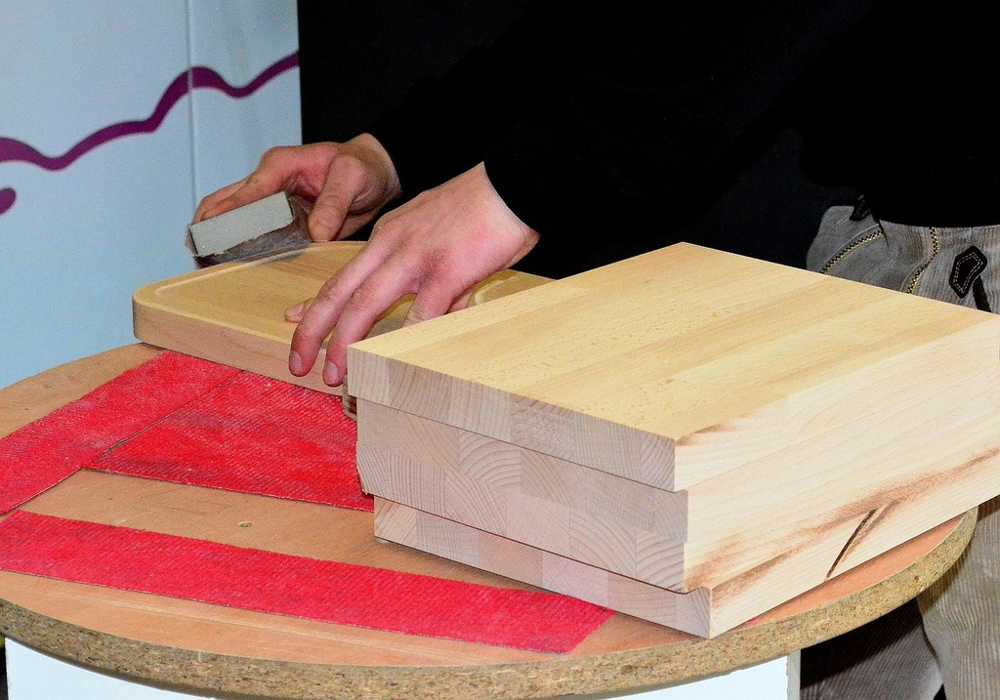
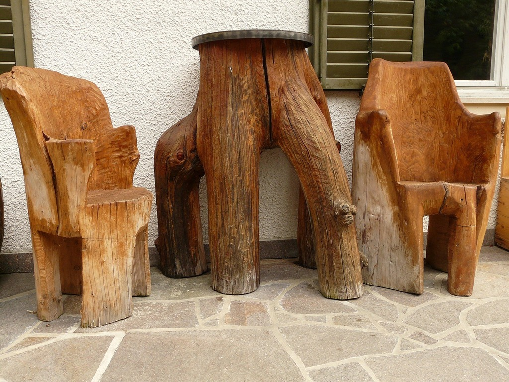

<!--
author:   Volker Göhler; Hilke Domsch

email:    hilke.domsch@gkz-ev.de

version:  0.0.4

language: de

narrator: Deutsch Male

edit: true
date: 2025-07-29
icon: ../assets/img/Logo_234px.png
logo: https://upload.wikimedia.org/wikipedia/commons/2/26/Stacked_Timber_Displaying_Growth_Rings.jpg

attribute: Title Image By Kelsey Todd, CC BY-SA 4.0 <https://creativecommons.org/licenses/by-sa/4.0>, via Wikimedia Commons

comment:  Quiz zu Eigenschaften von Holz -- Teil 2

link: ./style.css

import: https://raw.githubusercontent.com/Ifi-DiAgnostiK-Project/LiaScript_DragAndDrop_Template/refs/heads/main/README.md
        https://raw.githubusercontent.com/Ifi-DiAgnostiK-Project/Piktogramme/refs/heads/main/makros.md
        https://raw.githubusercontent.com/Ifi-DiAgnostiK-Project/LiaScript_ImageQuiz/refs/heads/main/README.md
        https://raw.githubusercontent.com/Ifi-DiAgnostiK-Project/Holzarten/refs/heads/main/makros.md

title: Holzarten II

tags:  Tischler,
       Holzarten

-->

# Überprüfen Sie Ihr Wissen zu den Holzarten II

Teil 2
=======

 <!-- style="width: 700px" -->

_Quelle: Pixabay, Detmold_

## Bestimmen Sie die Holzarten als Laub- oder Nadelholz

_Quelle aller Holz-Abbildungen:_ _https://holzvomfach.de/fachwissen-holz/holz-abc/ bzw. HWK Dresden, Florian Riefling_

 

<!-- data-randomize data-show-partial-solution -->
- [  [Laubholz]     [Nadelholz]  ]
- [    (x)             ( )       ] __Ahorn__ @Hoelzer1.Ahorn(10)
- [    ( )             (x)       ] __Weißtanne__ @Hoelzer1.Weisstanne(10)
- [    ( )             (x)       ] __Fichte__ @Hoelzer1.Fichte(10)
- [    (x)             ( )       ] __Buche__ @Hoelzer1.Buche(10)
- [    (x)             ( )       ] __Eiche__ @Hoelzer2.Eiche2(10)
- [    ( )             (x)       ] __Kiefer__ @Hoelzer1.Kiefer(10)

## Zu welcher Holzart gehört folgende Beschreibung?

<!--style="font-size: huge; color: red"-->Hinweis: Es können mehrere Antworten richtig sein.

-----------------

<!--style="color: green"  -->Dieses Holz besitzt einen hohen Harzgehalt, oft mit sichtbaren Harzkanälen.
 
Es kann in der Regel für Innen- und Außengestaltungen eingesetzt werden.
 
Es ist ein typisch deutsches Bauholz.

<!--data-randomize -->
- [( )] Kiefer
- [( )] Tanne
- [(X)] Fichte
- [( )] Linde

Welche Hölzer sind typischerweise hell in der Farbe?
===

<section class="flex-container">

<!--data-randomize -->
- [[ ]] Nussbaum
- [[X]] Ahorn
- [[ ]] Mahagonie
- [[X]] Fichte

<!-- style="width: 250px" -->

<a  href="https://pixabay.com/de/photos/tischler-schreiner-handwerk-3280956/" target=_blank>_Quelle: Pixabay, Detmold_</a>

</section>

## Welche Holzarten haben keine Harzkanäle?

<!--style="color:green"-->Ziehen Sie alle richtigen Antworten in die Box.
===

<!-- data-randomize data-show-partial-solution -->
@dragdropmultiple(@uid, Robinie|Tanne|Nussbaum|Edelkastanie,Fichte|Douglasie|Lärche)

>_Auswertung stimmt nicht. Obwohl die richtigen Begriffe in den Box gezogen werden, kommt ein falsches Ergebnis._

## Entscheiden Sie, welche Holzarten eher hart oder weich sind

<!--style="color:green"--> Die Verarbeitung und auch das Einsatzgebiet von Holz ist davon abhängig, ob es sich um weiches oder hartes Holz handelt.

_Quelle aller Holz-Abbildungen:_ _https://holzvomfach.de/fachwissen-holz/holz-abc/ bzw. HWK Dresden, Florian Riefling_

---------------------------

<!-- data-randomize data-show-partial-solution -->
- [  [Hartholz]     [Weichholz]  ]
- [    (x)             ( )       ] __Ulme (auch Rüster)__ @Hoelzer1.Ulme_Ruester(10)
- [    ( )             (x)       ] __Linde__ @Hoelzer1.Linde(10)
- [    ( )             (x)       ] __Schwarzerle__ @Hoelzer1.Schwarzerle(10)
- [    (x)             ( )       ] __Edelkastanie__ @Hoelzer1.Edelkastanie(10)
- [    (x)             ( )       ] __Esche__ @Hoelzer1.Esche(10)

## Holzarten und ihre Verwendungsmöglichkeiten

<!--style="font-size: huge; color: red"-->Hinweis: Es können mehrere Antworten richtig sein.

-----------------

<!--style="color:green"-->Welche der genannten Holzarten sind typisch für "rustikale", wetterfeste Gartenmöbel?
===

<section class="flex-container">

<!--data-randomize -->
- [[ ]] Birne
- [[ ]] Kirschbaum
- [[X]] Lärche
- [[X]] Eiche
- [[X]] Robinie

<!-- style="width: 250px" -->

<a  href="https://pixabay.com/de/photos/m%C3%B6bel-tisch-stuhl-holz-gartenm%C3%B6bel-617/" target=_blank>_Quelle: Pixabay, Hans_</a>

</section>

-------------------

<!--style="color:green"-->Auf welche Holzart treffen die Aussagen zu?
===

<!-- data-randomize data-show-partial-solution -->
[[ Robinie | (Eiche) | Teak]] ist wegen seiner auffälligen Fladerung (markante schmale Markstrahlen) und Härte beliebt für hochwertige Böden und rustikale Möbel.

## Holz - seine Eigenschaften - seine Verwendung

<!--style="font-size: huge; color: red"-->Hinweis: Es können mehrere Antworten richtig sein.

-------------------------

<!--style="color:green"-->Eschenholz wird aufgrund seiner Härte, Zähigkeit und Elastizität vielseitig eingesetzt.   Welche Verwendungszwecke sind richtig?
===

<!--data-randomize -->
- [[X]] Bootsbau
- [[X]] Brennholz
- [[ ]] Papierherstellung
- [[ ]] Spanplatten für Möbelindustrie
- [[X]] Werkzeugstiele
- [[X]] Skier
- [[X]] Musikinstrumente

--------------

<!--style="color:green"-->Welche Holzart ist gemeint?
===

<!--style="color:green"-->Dieses Holz wird aufgrund seiner Witterungsbeständigkeit und Langlebigkeit gesschätzt. Besonders gern wird es für Fassadenverkleidungen und Terassen im Außenbereich eingesetzt. Es ist harzhaltig.

<!--data-randomize -->
- [( )] Tanne
- [(X)] Lärche
- [( )] Kiefer
- [( )] Fichte

## Geschafft ! 👏

<!-- style="width: 500px" -->

<a  href="https://pixabay.com/de/illustrations/freude-springen-luftsprung-spa%C3%9F-3940425/" target=_blank>_Quelle: Pixabay, geralt_</a>
