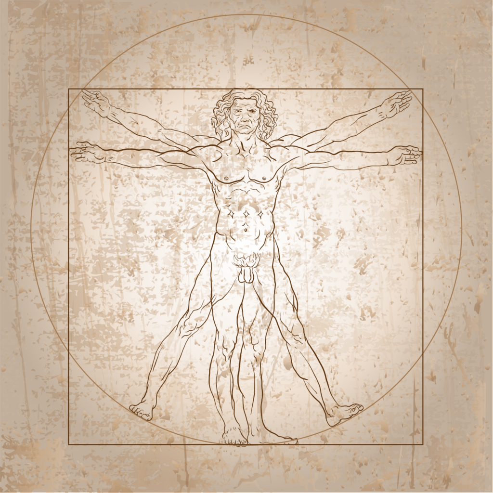
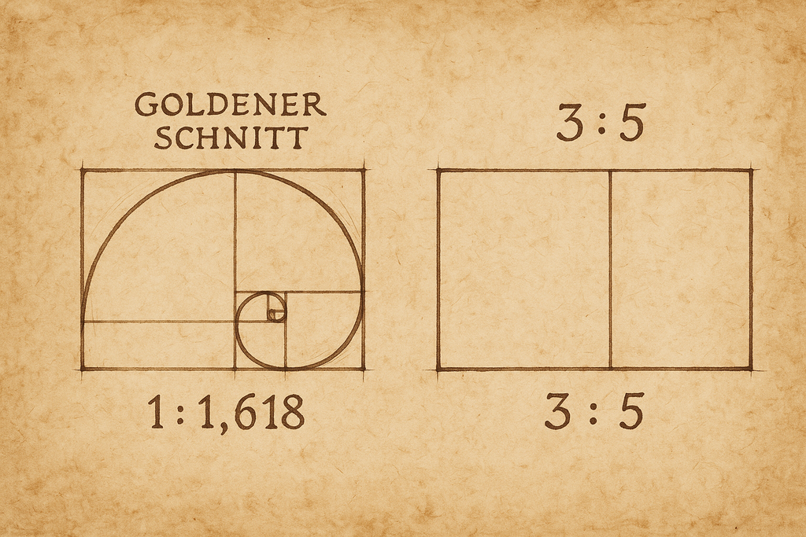
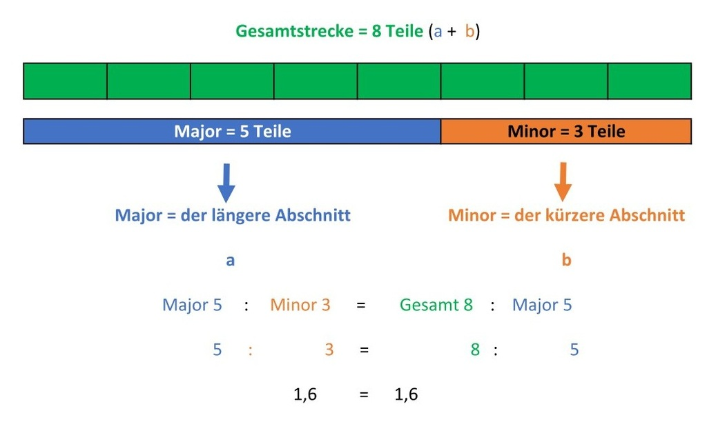
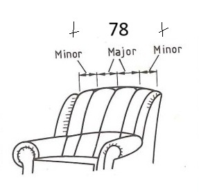
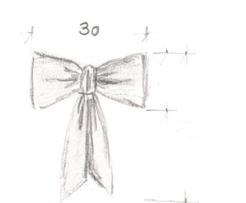
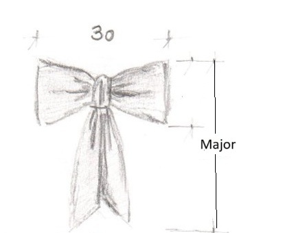
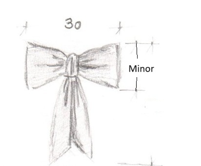
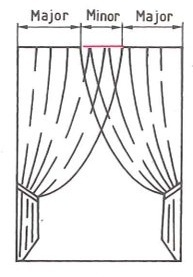
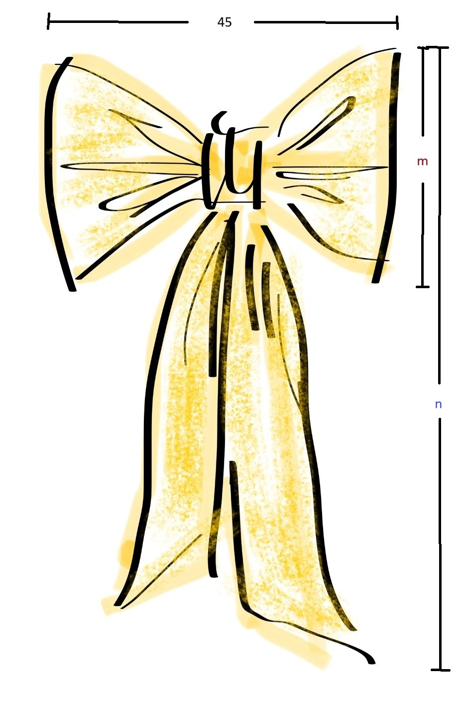

<!--

author:   Hilke Domsch, Volker Göhler

email:    hilke.domsch@gkz-ev.de

version:  0.1.3

language: de

narrator: Deutsch Male

comment:  Goldener Schnitt -- Raumausstatter

edit: true
date: 2025-07-08
logo: ../assets/img/da_vinci.png
icon: ../assets/img/Logo_234px.png

import: https://raw.githubusercontent.com/Ifi-DiAgnostiK-Project/LiaScript_DragAndDrop_Template/refs/heads/main/README.md
import: https://raw.githubusercontent.com/Ifi-DiAgnostiK-Project/Piktogramme/refs/heads/main/makros.md
import: https://raw.githubusercontent.com/Ifi-DiAgnostiK-Project/LiaScript_ImageQuiz/refs/heads/main/README.md

import: https://raw.githubusercontent.com/liaTemplates/algebrite/master/README.md

tags:   Raumausstatter

@style
.flex-container {
    display: flex;
    flex-wrap: wrap; /* Allows the items to wrap as needed */
    align-items: stretch;
    gap: 20px; /* Adds both horizontal and vertical spacing between items */
}

.flex-child {
    flex: 1;
    margin-right: 20px; /* Adds space between the columns */
}

@media (max-width: 600px) {
    .flex-child {
        flex: 100%; /* Makes the child divs take up the full width on slim devices */
        margin-right: 0; /* Removes the right margin */
    }
}
@end

-->

# Der Goldene Schnitt

<!-- style="width: 400px;" -->

## Einführung

<!--style="font-size: large;"-->Der __Goldene Schnitt__ ist ein besonderes Verhältnis, das häufig in der Kunst, Architektur und Natur vorkommt.

<!--style="font-size: large;"-->Es beträgt   1 <!--style="color:green;"-->  :   1,618 <!--style="color:green;"--> zwischen zwei verschiedenen Größen bzw. 38,2% <!--style="color:green;"--> zu 61,8% <!--style="color:green;"-->.

<!--style="font-size: large;"-->In der Praxis wird oft das angenäherte Verhältnis **3:5** <!--style="color:red;"--> bzw. **5:8** <!--style="color:red;"--> verwendet.

<!--style="font-size: large;"-->Dieses ungleiche Verhältnis zwischen zwei Größen wird als besonders schön und harmonisch empfunden.

<!-- style="width: 800px" -->

## 🎨 Grafische Darstellung des Goldenen Schnitts

Die folgende Grafik zeigt ein typisches Teilungs-Verhältnis des Goldenen Schnitts:

Verhältnis 3  :  5
===

 <!-- style="width: 800px" -->

Die kleinere Teilstrecke (Minor) verhält sich zur größeren Teilstrecke (Major) wie die größere Teilstrecke (Major) zur Gesamtstrecke.

## 🧪 Interaktive Darstellung des Goldenen Schnitts

Ein kleines Video fasst die wichtigsten Dinge zum Goldenen Schnitt in 3 Minuten zusammen.

[Studyflix.de -- goldener Schnitt](https://studyflix.de/allgemeinwissen/goldener-schnitt-6943?topic_id=640)

---

# Goldener Schnitt in Zahlen

Formel des Goldenen Schnitts
=============================

Der Goldene Schnitt teilt eine Strecke so, dass:

$$
\frac{a + b}{a} = \frac{a}{b} = \varphi \approx 1{,618}
$$

wobei:

- $a$ die **Major-Strecke** ist (größerer Abschnitt),
- $b$ die **Minor-Strecke** ist (kleinerer Abschnitt),
- $\varphi$ (Phi) die irrationale Zahl ist, definiert durch:

$$
\varphi = \frac{1 + \sqrt{5}}{2} \approx 1{,6180339887\dots}
$$

---

Näherungen des Goldenen Schnitts
=================================

Einige gebräuchliche rationale Näherungen für $\varphi$ sind:

- **Verhältnis 3:5**
  $$
  \frac{5}{3} \approx 1{,666}
  $$

- **Verhältnis 5:8**
  $$
  \frac{8}{5} = 1{,6}
  $$

Diese Näherungen sind praktisch, wenn exakte irrationale Zahlen im Alltag oder beim Gestalten nicht benötigt werden.

---

## 🧠 Quiz: Verstehst du den Goldenen Schnitt?

Welche der folgenden Zahlenpaare stehen im ungefähren Verhältnis des Goldenen Schnitts?
===
<!-- data-randomize -->
- [[ ]] 2 : 3
- [[x]] 3 : 5
- [[x]] 5 : 8
- [[ ]] 4 : 6

### Was beschreibt der Goldene Schnitt?

<!-- data-randomize -->
- [( )] Eine Methode zur Berechnung von Kreisflächen
- [(x)] Ein Verhältnis, bei dem sich der kleinere Teil zum größeren Teil so verhält wie der größere zum Ganzen
- [( )] Eine Technik zum Messen von Winkeln
- [( )] Eine Methode zur Berechnung von Volumen

### Welche Aussagen über den Goldenen Schnitt sind richtig?

<!-- data-randomize -->
- [[x]] Der Wert des Goldenen Schnittes beträgt ungefähr 1,618.
- [[x]] Er kommt in der Natur vor.
- [[ ]] Er ist immer größer als 3.
- [[x]] Er wird oft in der Kunst verwendet.

### Wo kommt der Goldene Schnitt vor?

<!-- data-randomize -->
- [[x]] In Blumen und Pflanzen
- [[x]] In Kunst und Architektur
- [[ ]] In der Zahl Pi
- [[x]] In Schneckenhäusern

### Aufteilungen mit dem Goldenen Schnitt

_Tipp: Schauen Sie in der "Einführung" nach. Geben Sie mindestens drei Nachkommastellen an._

Der ungefähre Faktor "Goldener Schnitt" lautet  [[  1,618  ]].@Algebrite.check2(1.618,0.001)

_Tipp: Und hier mindestens eine Nachkommastelle._

Der Prozentsatz des Minor beträgt  [[  38,2  ]] %.@Algebrite.check2(38.2,0.1)

Der Prozentsatz des Major beträgt [[  61,8 ]] %.@Algebrite.check2(61.8,0.1)

---

#### Teilen Sie folgende Strecken nach dem Goldenen Schnitt und berechnen Sie Minor und Major:

<!--style="font-size: large;"-->_Hinweis: Nutzen Sie die 5:3 Näherung. Runden Sie auf zwei Stellen nach dem Komma._

---

Beispiel 1:
===

Gardine mit einer Gesamtlänge von 1,56 m.

Die Minor-Strecke beträgt [[  0,59  ]] m. @Algebrite.check2(0.585,0.01)

Die Major-Strecke beträgt [[  0,98  ]] m. @Algebrite.check2(0.975,0.01)
*****
Auflösung:
==========

Wir verwenden die Verhältnisrechnung mit der Näherung $5:3$ für den Goldenen Schnitt. Die Gesamtstrecke wird also in **8 Teile** zerlegt:

- **5 Teile** = **Major-Strecke (a)**
- **3 Teile** = **Minor-Strecke (b)**
- **8 Teile** = **Gesamtlänge (1,56 m)**

Berechnung der Teilstrecke
===========================

$ \text{Ein Teil} = \frac{1{,56\,\text{m}}}{8} = 0{,195}\,\text{m} $

Berechnung der Strecken
========================

- **Minor-Strecke (b):** $ 3 \cdot 0{,195} = 0{,585}\,\text{m} $
- **Major-Strecke (a):** $ 5 \cdot 0{,195} = 0{,975}\,\text{m} $

Ergebnis
========

- **Major-Strecke:** $ a = 0{,975}\,\text{m} $
- **Minor-Strecke:** $ b = 0{,585}\,\text{m} $

Die Strecke von **1,56 m** ist damit im Verhältnis **5:3** gemäß dem Goldenen Schnitt angenähert aufgeteilt.

*****

---

Beispiel 2:
===

Auf die Stirnwand eines Raumes soll eine Fototapete aufgebracht werden. Sie steht nur mit einer Breite von 105 cm (= Minor) zur Verfügung.

Wie hoch (= Major) ist die Fototapete zu tapezieren, damit die Maßverhältnisse nach dem Goldenen Schnitt harmonisch wirken?

_Achtung: Die Angabe ist in Meter mit 2 Stellen nach dem Komma._

[[  1,75 ]] m. @Algebrite.check2(1.75,0.01)
*****

Lösung
======

**Gegeben:**

- **Breite (Minor-Strecke):** $ b = 105\,\text{cm} $

---

Berechnung mit Näherung (Verhältnis 5:3)
========================================

Verhältnis:
$ \frac{a}{b} = \frac{5}{3} \Rightarrow a = \frac{5}{3} \cdot 105 = 175\,\text{cm} $

---

Berechnung mit echtem Goldenen Schnitt
======================================

Verhältnis:
$ \varphi \approx 1{,618} \Rightarrow a = 1{,618} \cdot 105 = 169{,89}\,\text{cm} $

---

Ergebnisübersicht
=================

| Methode                        | Höhe (Major-Strecke a) |
|-------------------------------|-------------------------|
| Näherung (5:3)                | **175,00 cm**           |
| Echter Goldener Schnitt (φ)   | **169,89 cm**           |
| **Differenz**                 | **5,11 cm**             |

---

**Fazit:**
Die Näherung mit dem Verhältnis $5:3$ führt zu einer etwas höheren Tapete (um ca. **5,1 cm**),
bleibt aber visuell sehr nahe am harmonischen Ideal des echten Goldenen Schnitts.
*****
---

Beispiel 3:
===

Die Rückenfläche des Sessels mit einer Gesamtbreite von 78 cm soll eine Unterteilung in Pfeifen erhalten.

1. Die Breite der beiden äußeren Pfeifen (= Minor) beträgt jeweils  [[  14,63  ]] cm. @Algebrite.check2(14.63,0.01)

2. Die Breite der beiden inneren Pfeifen (= Major) beträgt jeweils [[  24,38  ]] cm.@Algebrite.check2(24.38,0.01)

_Hinweis: Bitte auf 2 Stellen nach dem Komma gerundet angeben._

## ✏️ Praxisaufgabe: Dekorationsschleife

Sie haben während Ihrer überbetrieblichen Ausbildung eine Dekorationsschleife gefertigt.

Diese besteht aus zwei Teilen, dem oberen  Schleifen- [[  (körper)|band | stoff]]   und dem unteren Schleifen- [[  körper|(band)|stoff  ]].

Diese beiden Teile stehen im Verhältnis   __3:5__   zueinander.

---

Schauen Sie sich die folgende Skizze an.
------------------

---

Lesen Sie die Breite der Gesamtschleife (Minor) ab:
---------------------

 [[  30  ]] cm

### Berechnen Sie die Gesamtlänge der Schleife unter Beachtung des Verhältnisses 3 : 5.

<!--style="font-size: medium;"-->__Berechnung:__

$3$ Teile (**Minor**) = [[ 30 ]] $\text{cm}$ = Schleifenbreite

$1$ Teil = [[ 10 ]] $\text{cm}$

$5$ Teile (**Major**) = [[ 50 ]] $\text{cm}$ = Gesamtlänge der Schleife
*****
Rechenweg
=========

- **Minor-Strecke** (3 Teile): $30\,\text{cm}$
- Verhältnis: $3 : 5$
- Gesucht: **Major-Strecke** (5 Teile)

---

Berechnung:
===========

Ein Teil entspricht:
$$
\frac{30\,\text{cm}}{3} = 10\,\text{cm}
$$

Major-Strecke (5 Teile):
$$
5 \cdot 10\,\text{cm} = 50\,\text{cm}
$$

---

Ergebnis:
=========

- **Minor-Strecke:** $30\,\text{cm}$
- **Major-Strecke:** $50\,\text{cm}$

*****

### Berechnen Sie die Höhe des Schleifenkörpers unter Beachtung des Verhältnisses 3 : 5.

_Tipp: In der vorherigen Aufgabe entsprach die Breite des Schleifenkörpers der Minor-Strecke, um daraus die Gesamtlänge des Schleifenbands (Major) zu berechnen. Jetzt ist die Höhe des Schleifenkörpers gesucht und die Breite des Schleifenkörpers stellt die Major-Strecke dar._

---

<!--style="font-size: medium;"-->__Berechnung:__

$5$ Teile (**Major**) = [[ 30 ]] $\text{cm}$ = Schleifenbreite

$1$ Teil = [[ 6 ]] $\text{cm}$

$3$ Teile (**Minor**) = [[ 18 ]] $\text{cm}$ = Höhe des Schleifenkörpers
*****
Rechenweg
--------

- **Major-Strecke** (5 Teile): $30\,\text{cm}$
- Verhältnis: $3 : 5$
- Gesucht: **Minor-Strecke** (3 Teile)

---

Berechnung:
===========

Ein Teil entspricht:
$$
\frac{30\,\text{cm}}{5} = 6\,\text{cm}
$$

Minor-Strecke (3 Teile):
$$
3 \cdot 6\,\text{cm} = 18\,\text{cm}
$$

---

Ergebnis:
=========

- **Major-Strecke:** $30\,\text{cm}$
- **Minor-Strecke:** $18\,\text{cm}$

*****

<!--style="font-size: large;"-->Auf der nächsten Folie gibt es ein Beispiel für die Berechnung im Verhältnis 5 : 8

---

### 🎁 Goldener Schnitt - Beispielrechnung 5 : 8

Eine Gardine soll gerafft werden. Die beiden Schals sind so übereinander zu dekorieren, dass der mittlere (überdeckte) Abschnitt der Dekoration (Minor<!--style="font-weight:bold;color:navy;"-->) 1,55<!--style="font-weight:bold;color:navy;"--> m<!--style="font-weight:bold;color:navy;"--> misst.

Es wird von einem Verhältnis __5:8__<!--style="color:green;font-size: large"--> ausgegangen.

<section class="flex-container">

Wie breit sind die beiden größeren, nicht überlappenden Schals (Major<!--style="font-weight:bold;color:orange;"-->)?

Wie breit ist die Gardine insgesamt<!--style="font-weight:bold;color:red;"-->?

</section>

<!--style="font-size: medium;"-->__Berechnung:__

- $5$<!--style="font-weight:bold;color:navy;"--> Teile<!--style="font-weight:bold;color:navy;"--> (Minor<!--style="font-weight:bold;color:navy;"-->) $\text{=}$ $1,55$ $\text{m}$ = Überlappung der Gardinen
- $1$ Teil $\text{=}$ $0,31$ $\text{m}$
- $8$<!--style="font-weight:bold;color:orange;"--> Teile<!--style="font-weight:bold;color:orange;"--> (Major<!--style="font-weight:bold;color:orange;"--> gesamt<!--style="font-weight:bold;color:orange;"-->) $\text{=}$ $2,48$ $\text{m}$ = Gesamtbreite links und rechts zusammen
- $4$<!--style="font-weight:bold;color:orange;"--> Teile<!--style="font-weight:bold;color:orange;"--> (hälftiger<!--style="font-weight:bold;color:orange;"--> Major<!--style="font-weight:bold;color:orange;"-->) $\text{=}$ $1,24$ $\text{m}$ = je Gardinenbreite links und rechts einzeln
- Gesamtbreite<!--style="font-weight:bold;color:red;"--> der<!--style="font-weight:bold;color:red;"--> Gardine<!--style="font-weight:bold;color:red;"--> $\text{=}$ $1,24$<!--style="font-weight:bold;color:orange;"--> $\text{m}$<!--style="font-weight:bold;color:orange;"--> $\text{+}$ $1,55$<!--style="font-weight:bold;color:navy;"-->  $\text{m}$<!--style="font-weight:bold;color:navy;"-->  $\text{+}$ $1,24$<!--style="font-weight:bold;color:orange;"--> $\text{m}$<!--style="font-weight:bold;color:orange;"--> $\text{=}$ $4,03$<!--style="font-weight:bold;color:red;"--> $\text{m}$ <!--style="font-weight:bold;color:red;"-->

### ✏️✏️ Falls Sie noch einmal üben wollen: Hier können Sie eine weitere Dekorationsschleife berechnen

 <!-- style="width: 400px" -->

Aufgabe 1: Berechnen Sie die Länge der Gesamtschleife $n$. Das Verhältnis beträgt 5 : 8.
===

Der $\text{Minor}$ (= Schleifenbreite) beträgt [[  3 | (5) | 8 | 13 ]] Teile<!--style="font-weight:bolder;"-->.

$1$ $\text{Teil}$ $\text{=}$ [[  9 ]]  $\text{cm}$

Der $\text{Major}$ $\text{n}$<!--style="font-weight:bold;color:black;"--> (=Schleifenlänge) beträgt [[  72 ]]  $\text{cm}$.
*****
✅ Aufgabe 1: Gesamtschleife berechnen
====

**Gegeben:**

- Verhältnis: 5 : 8
- Minor = **5 Teile** = **45 cm**
- 1 Teil = **9 cm** = Minor $/ 5$

**Gesucht:** Gesamtlänge der Schleife $n$ (Major)

**Berechnung:**

- Minor = 5 × 9 cm = **45 cm**
- Major = 8 × 9 cm = **72 cm**

**✅ Ergebnis:** Die Gesamtlänge ist **72 cm**.
*****

-----

Aufgabe 2: Berechnen Sie die Höhe Des Schleifenkörpers $m$. Das Verhältnis beträgt 5 : 8.
===

Der $\text{Major}$ (= Schleifenbreite) beträgt [[  3 | 5 | (8) | 13 ]] Teile.

$1$ $\text{Teil}$ $\text{=}$ [[  5,62 ]]  $\text{cm}$@Algebrite.check2(5.625,0.1)

Der $\text{Schleifenkörper}$ $\text{m}$<!--style="font-weight:bold;color:red;"--> ist [[  28,1 ]]  $\text{cm}$ hoch.@Algebrite.check2(28.125,0.1)
*****

✅ Aufgabe 2: Höhe des Schleifenkörpers berechnen
====

**Gegeben:**

- Verhältnis: 5 : 8
- Major = **8 Teile** = $45 \text{ cm}$
- 1 Teil = **5,625 cm** = Minor $/ 8$

**Gesucht:** Höhe $m$ (Minor)

**Berechnung:**

- Major = 8 × 5,625 cm = **45 cm**
- Minor = 5 × 5,625 cm = **28,125 cm**

**✅ Ergebnis:** Die Höhe des Schleifenkörpers beträgt **28,1 cm**.
*****

---

Viel Spaß beim Üben!
===
