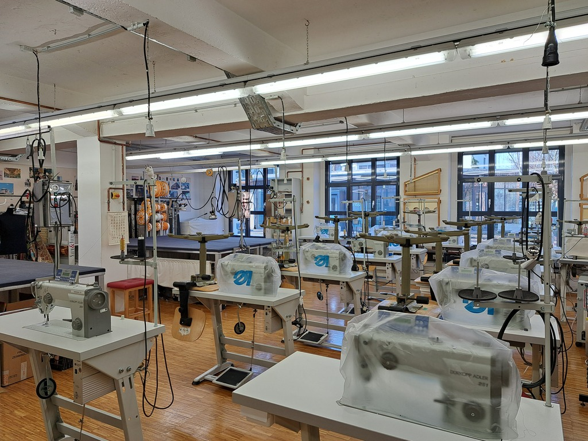
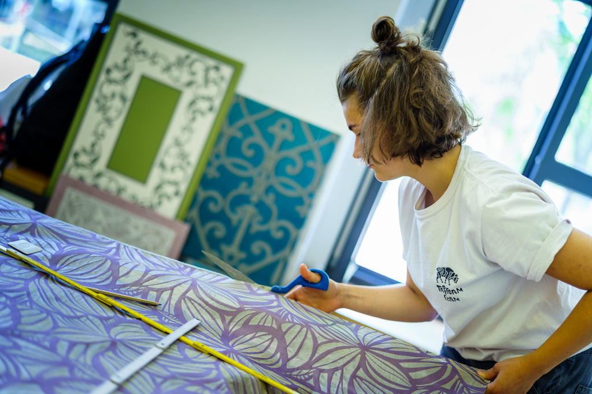

<!--

author:   Hilke Domsch

email:    hilke.domsch@gkz-ev.de

version:  0.1.3

language: de

narrator: Deutsch Male

comment:  Grundkurs Raumausstatter

edit: true
date: 2025-06-24
logo: ../assets/img/hwk1.jpg
icon: ../assets/img/Logo_234px.png

tags:   Raumausstatter

link: ./style.css
import:    https://raw.githubusercontent.com/Ifi-DiAgnostiK-Project/LiaScript_DragAndDrop_Template/refs/heads/main/README.md
           https://raw.githubusercontent.com/Ifi-DiAgnostiK-Project/Piktogramme/refs/heads/main/makros.md
           https://raw.githubusercontent.com/Ifi-DiAgnostiK-Project/LiaScript_ImageQuiz/refs/heads/main/README.md
           https://raw.githubusercontent.com/Ifi-DiAgnostiK-Project/Bildersammlung/refs/heads/main/makros.md

-->

# Grundstufe Raumausstatter Kurs GR-06

_Quelle: GKZ_

>_Wenn Kay Lust hat, wäre hier eine kurze Videosequenz möglich, wo kurz zusammmengefasst alle praktischen Arbeiten des Kurses vorgestellt werden._

##  Überprüfungsaufgaben

Sie haben in den letzten Tagen Werkzeuge und Grundhandgriffe im Raumausstatterhandwerk kennengelernt und eingeübt.
===

<!--style="color:blue; font-weight: bolder; font-size: large"-->
Überprüfen Sie Ihr Wissen - viel Erfolg!

<!--style="font-size: huge; color: red"-->Hinweis: Es können mehrere Antworten richtig sein.

----------------

_Quelle: HWK Dresden, André Wirsing_

## 1. Der Schnellnäher Dürkopp Adler 281

Auch wenn jede Nähmaschine im Detail etwas anders ist, wiederholen sich Grundelemente und -funktionen.

Im Grundkurs Raumausstatter haben Sie einen Schnellnäher der Marke Dürkopp Adler kennengelernt.

Können Sie die einzelen Bezeichnungen am Schnellnäher Dürkopp Adler 281 den verschiedenen Nummern laut Zeichnung zuordnen?

<!--style="color:blue; font-weight: bolder; font-size: large"-->
Wählen Sie zu jeder Teile-Bezeichung die richtige Nummer aus.

----------------

, alle Rechte vorbehalten._")<!-- style="width: 800px" -->

${Arm}$: [[ (1) | 2 | 3 | 4 | 5 | 6 | 7 | 8 | 9 | 10 | 11 | 12 | 13 | 14  | 15  | 16 | 17 ]] 

>_Ich hätte gern nach jedem Doppelpunkt ein Leerzeichen. Mit &nbsp; und Unicode \u00A0 funktioniert das leider nicht._

>_HWK Raumausstatter: Bitte die Zahlen richtig bezeichnen!_

## 2. Was ist beim Zuschneiden von Dekorationsstoffen zu beachten?

<!--style="color:blue; font-weight: bolder; font-size: large"-->
Klicke alle richtigen Angaben an!

------------

<section class="flex-container">

<!-- data-randomize -->
- [[X]] Fadenlauf
- [[X]] Webkante
- [[X]] Rapport
- [[X]] Musterung
- [[X]] Materialart
- [[X]] Zuschnittplan
- [[ ]] Fadenfarbe
- [[ ]] Fusselkante

@Raumausstatter_Materialien.Rapportstoff_fadengerade1(20)

 _Quelle: HWK Dresden, Florian Riefling_

</section>

## 3. Welche Polsteruntergründe kennen Sie?

<!--style="color:blue; font-weight: bolder; font-size: large"-->
Ordnen Sie richtig zu!

-----------------

<!-- data-randomize -->
- [[Polsteruntergrund - ja] (Polsteruntergrund - nein)]
- [    ( )                       (X)                  ]  Leisten
- [    (X)                       ( )                  ]  Holzplatte
- [    (X)                       ( )                  ]  Gurtung
- [    ( )                       (X)                  ]  Polsterpappe
- [    (X)                       ( )                  ]  Federkorb
- [    (X)                       ( )                  ]  Wellenfedern
- [    ( )                       (X)                  ]  Gummikokos

--------------------------

>_Ich habe diese Abfrage mal noch in eine andere Quizform gepackt:_

<!--style="color:blue; font-weight: bolder; font-size: large"-->
Ziehen Sie die zutreffenden Begriffe für Polsteruntergründe ins Antwortfeld:

----------------

<!-- data-randomize -->
@dragdropmultiple(@uid,Federkorb|Gurtung|Wellenfedern|Holzplatte,Polsterpappe|Gummikokos|Leisten)

## 4. Welche Nahtarten gehören zu den Handnähten?

<!--style="color:blue; font-weight: bolder; font-size: large"-->
Entscheiden Sie sich für die richtige Handnaht: 🤷‍♀️

-----------------

<!-- data-randomize -->
- [( )] vorgezogener Stich
- [(X)] verzogener Stich

 

<!-- data-randomize -->
- [( )] überwundener Stich
- [(X)] überwendlicher Stich

 

<!-- data-randomize -->
- [( )] Kettelnaht
- [(X)] Rückstich

 

<!-- data-randomize -->
- [( )] Verbindungsnaht
- [(X)] Zierstich

 

<!-- data-randomize -->
- [( )] Säbelstich
- [(X)] Schwertstich

## 5. Welche Bodenbeläge verarbeitet der Raumausstatter ~~nicht~~?

<!--style="color:blue; font-weight: bolder; font-size: large"-->
Wählen Sie die entsprechenden Antworten aus.

-------------------------------

<section class="flex-container">

<!-- data-randomize -->
- [[ ]] CV Belag
- [[ ]] PVC Belag
- [[X]] Keramikfliesen
- [[ ]] Linoleum
- [[ ]] textile Beläge
- [[ ]] Laminat
- [[X]] Terrazzo
- [[ ]] Fertigparkett
- [[X]] Stabparkett
- [[ ]] Designbelag
- [[X]] Steinboden

@Raumausstatter_Materialien.CV_Belag_querschnitt(20)

 _CV Belag Querschnitt; Quelle: HWK Dresden, Florian Riefling_

</section>

## 6. Sie haben verschiedene Tapezierwerkzeuge kennengelernt.

<!--style="color:blue; font-weight: bolder; font-size: large"-->
Ordnen Sie richtig zu!

----------------------

<!-- data-randomize -->
- [[Tapezierwerkzeug - ja] (Tapezierwerkzeug - nein)]
- [               ( )           (X)                 ]  Zuschneidetisch
- [               ( )           (X)                 ]  Stecknadel
- [               (X)           ( )                 ]  Kreuzlaser
- [               (X)           ( )                 ]  Wasserwaage
- [               (X)           ( )                 ]  Cuttermesser
- [               ( )           (X)                 ]  Verlegemesser
- [               ( )           (X)                 ]  Gurtspanner

---------------------

<!--style="color:blue; font-weight: bolder; font-size: large"-->
Ordnen Sie auch auch hier richtig zu:

----------------------

<!-- data-randomize -->
- [[Tapezierwerkzeug - ja] (Tapezierwerkzeug - nein)]
- [               (X)           ( )                 ]  Lot
- [               (X)           ( )                 ]  Spachtel
- [               (X)           ( )                 ]  Tapezierbürste
- [               ( )           (X)                 ]  Drahtbürste
- [               ( )           (X)                 ]  Zahnspachtel
- [               (X)           ( )                 ]  Cutterkantschiene
- [               (X)           ( )                 ]  Schere
- [               (X)           ( )                 ]  Tapeziertisch

## Zusatz: Wiederholung zum Schnellnäher

<!--style="color:blue; font-weight: bolder; font-size: large"-->
Welche Teile gehören zum Schnellnäher? Wählen Sie richtig aus!

<!--style="font-size: huge; color: red"-->
Kleiner Tipp:

<!--style="font-size: huge; color: blue"-->  10 Angaben sind richtig 😄

------------

<!-- data-randomize -->
- [[X]] Gestell
- [[X]] Tischplatte
- [[X]] Kopf
- [[X]] Arm
- [[X]] Handrad
- [[X]] Nadelstange
- [[X]] Fadenheber
- [[X]] Spulenkapsel
- [[X]] Transporteur
- [[ ]] Hubtisch
- [[ ]] Ohr
- [[ ]] Finger
- [[ ]] Kurbel
- [[ ]] Gaspedal
- [[ ]] Fadengalgen

>_Können aus den richtigen und falschen Antworten per Zufall nur 6 ausgewählt werden?_

## Geschafft ! 👏

<!-- style="width: 500px" -->

<a  href="https://pixabay.com/de/illustrations/freude-springen-luftsprung-spa%C3%9F-3940425/" target=_blank>_Quelle: Pixabay, geralt_</a>
