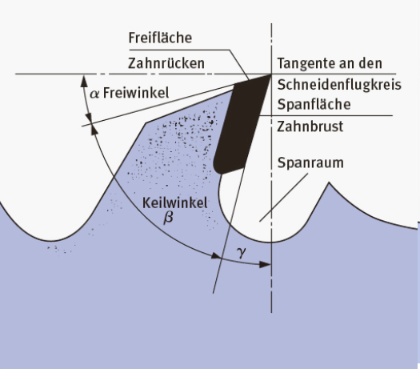
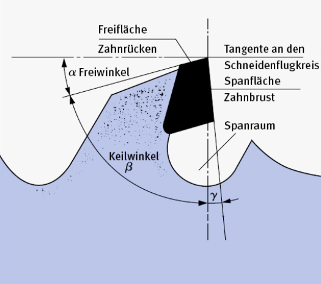
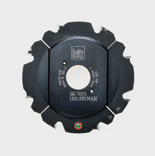
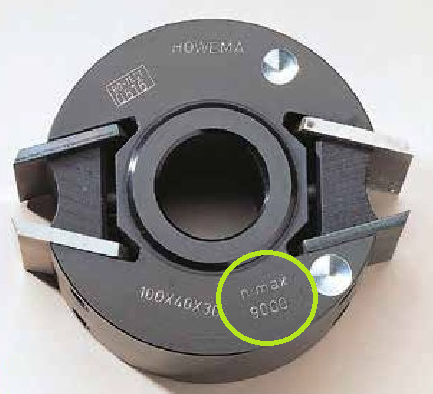
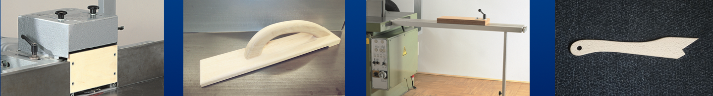

<!--

author:   Hilke Domsch
email:    hilke.domsch@gkz-ev.de
version:  0.1.12
language: de
narrator: Deutsch Male

edit: true
date: 2026-02-09

icon: ../assets/img/Logo_234px.png
logo: https://img.freepik.com/free-photo/professional-carpenter-working-with-sawing-machine_1157-35628.jpg
attribute: "[[_Quelle: Freepik, prostooleh_](https://www.freepik.com/free-photo/professional-carpenter-working-with-sawing-machine_8819639.htm#fromView=search&page=1&position=6&uuid=c6171409-8c97-44bd-bb3d-d9cb55127139&query=Tischfr%C3%A4schmaschine)]]"

comment:  TSM 1 Überprüfungsfragen

title: TSM 1 Überprüfungsfragen

link: ./style.css
link: https://raw.githubusercontent.com/vgoehler/TUBAF_Distributed_Software/refs/heads/main/./styles.css

import: https://raw.githubusercontent.com/Ifi-DiAgnostiK-Project/LiaScript_DragAndDrop_Template/refs/heads/main/README.md
        https://raw.githubusercontent.com/Ifi-DiAgnostiK-Project/Piktogramme/refs/heads/main/makros.md
        https://raw.githubusercontent.com/Ifi-DiAgnostiK-Project/Textilpflegesymbole/refs/heads/main/makros.md
        https://raw.githubusercontent.com/Ifi-DiAgnostiK-Project/LiaScript_ImageQuiz/refs/heads/main/README.md
        https://raw.githubusercontent.com/Ifi-DiAgnostiK-Project/Bildersammlung/refs/heads/main/makros.md
        https://raw.githubusercontent.com/Ifi-DiAgnostiK-Project/Tapetensymbole/refs/heads/main/makros.md

tags:  Tischler,
       Schreiner,
       Arbeitssicherheit,
       Holzbearbeitungsmaschinen,
       BGHM
-->
# TSM 1 - Überprüfungsfragen nach Abschluss des Praxiskurses

Die praktischen überbetrieblichen TSM<!-- style="font-weight: bolder; font-size: 12pt; color: green;"--> -<!-- style="font-weight: bolder; font-size: 12pt; color: green;"--> Lehrgänge<!-- style="font-weight: bolder; font-size: 12pt; color: green;"--> sind ein wichtiger Bestandteil Ihrer Ausbildung.\
In diesen Lehrgängen festigen und erweitern Sie Ihre Kenntnisse über das

<!-- class="hash"-->
- sichere Arbeiten an Sägemaschinen (Tisch- und Formatkreissäge, Bandsäge)
- sichere Arbeiten an stationären Hobelmaschinen (Abricht- und Dickenhobelmaschine)
- sichere Arbeiten mit Handmaschinen (Oberfräse, Formfedernutfräse, Handhobel und Handkreissäge)

Das vorliegende Quiz wiederholt Wissen aus G<!-- style="font-weight: bolder; font-size: 12pt; color: green;"-->-<!-- style="font-weight: bolder; font-size: 12pt; color: green;"-->TSM<!-- style="font-weight: bolder; font-size: 12pt; color: green;"--> und TSM<!-- style="font-weight: bolder; font-size: 12pt; color: green;"--> 1<!-- style="font-weight: bolder; font-size: 12pt; color: green;"-->.\
Damit haben Sie eine optimale Vorbereitung auf Ihren Abschlusstest.

Die Fragen bieten Ihnen die Möglichkeit, jederzeit nach und vor einem TSM-Lehrgang fachliche Impulse sowie Grundlagenwissen zu vertiefen und sich neues anzueignen.\
Die Fragen sind gemäß den Vorgaben der BGHM und den geltenden Unfallverhütungsvorschriften formuliert.

Gleichzeitig werden "Nebeneffekte" erreicht:

<!-- class="blueball"-->
- Erhöhung der Arbeitssicherheit,
- Reduzierung von Materialverschwendung
- Steigerung/Sicherung der Qualität

 

<!-- style="font-weight: bolder; font-size: 12pt; color: red;"-->
Die Module ersetzen nicht die praktischen überbetrieblichen TSM-Lehrgänge.

 

<!--class="highlight"-->
Testen Sie Ihr Wissen zum sicheren Umgang mit Holzbearbeitungsmaschinen!

------------

 

")<!-- style="max-width: 450px; width: 100%" -->

## Die Berufsgenossenschaft Holz und Metall (BGHM)

Was ist die BGHM?

Die BGHM ist eine gesetzliche Unfallversicherung für Betriebe, die Holz, Kunststoffe und Metalle be- oder verarbeiten, dazu gehören Tischler- und Schreinerbetriebe.

Sie ist eine Körperschaft des öffentlichen Rechts mit Selbstverwaltung und gehört zum System der deutschen Sozialversicherung.

Ihre Hauptaufgaben sind:

1. **Verhütung** von Arbeitsunfällen, Berufskrankheiten und arbeitsbedingten Gesundheitsgefahren, zum Beispiel durch Regeln, Schulungen und Praxishilfen für eine sichere Arbeit im Tischlerhandwerk
2. **Versorgung** nach einem Unfall oder bei einer Berufskrankheit: medizinische Behandlung, Rehabilitation und finanzielle Entschädigung für Versicherte und Hinterbliebene

 

")<!-- style="max-width: 450px; width: 100%" -->

<!--style="background-color:#FFA500;color: white"-->
> Hinweise zur Lösung für die nachfolgenden Aufgaben finden Sie im TSM-Lehrgangsbegleitheft, S. 6-7.

### Was ist eine Berufsgenossenschaft?

<section class="flex-container border">

<!-- class="highlight" -->
Was sind die Berufsgenossenschaften?

<!--
data-randomize
data-solution-button="off"
data-max-trials="3"
-->
- [(X)] Täger der gesetzlichen Unfallversicherung
- [( )] Berufsverbände
- [( )] eine Einkaufsorganisation
- [( )] eine private Unfallversicherung, finanziert durch die Arbeitgeber
********************
Die richtige Lösung lautet: Träger der gesetzlichen Unfallversicherung.
********************

<!-- style="max-width: 300px; width: 140%;margin-left: -50px; margin-top:20px;" -->

</section>

### Aufgaben einer Berufsgenossenschaft?

<section class="flex-container border">

<!-- class="highlight" -->
Für welche Aufgabengebiete ist eine Berufsgenossenschaft zuständig?

<!--
data-randomize
data-solution-button="off"
data-max-trials="3"
-->
- [(X)] Sicherheit und Gesundheitsschutz am Arbeitsplatz
- [( )] Mutterschutz
- [( )] Sportunfälle in der Freizeit
- [( )] Sicherheit und Gesundheitsschutz auch im Haushalt
********************
Eine Berufsgenossenschaft ist für die Sicherheit und den Gesundheitsschutz am Arbeitsplatz zuständig.
********************

<!-- style="max-width: 300px; width: 140%;margin-left: -50px; margin-top:20px;" -->

</section>

### Versicherungsschutz

<section class="flex-container border">

<!-- class="highlight" -->
In welchen Fällen besteht ein gesetzlicher Versicherungsschutz?

<!-- style="font-weight: bolder; font-size: 10pt; color: #A00000;"-->
Es sind mehrere Antworten richtig!

<!--
data-randomize
data-solution-button="off"
data-max-trials="3"
-->
- [[X]] nach Arbeitsunfällen
- [[ ]] bei eigenwirtschaftlicher Tätigkeit
- [[X]] bei Wegeunfällen
- [[ ]] während des Urlaubs
- [[X]] bei Berufskrankheiten
********************
Folgende Antworten sind richtig:\
- nach Arbeitsunfällen
- bei Wegeunfällen
- bei Berufskrankheiten
********************

")<!-- style="max-width: 700px; width: 100%; margin-left: -80px; margin-top:0px;" -->

</section>

### Eigenwirtschaftliche Tätigkeit

<section class="flex-container border">

<!-- class="highlight" -->
Was wird als "eigenwirtschaftliche Tätigkeit" bezeichnet?

<!--
data-randomize
data-solution-button="off"
data-max-trials="3"
-->
- [( )] Arbeiten im Auftrag des Betriebes
- [( )] eigene (neben-)berufliche Selbständigkeit
- [( )] Besorgungen für den Betrieb
- [(X)] Arbeiten im Betrieb für den eigenen Bedarf
********************
Unter "eigenwirtschaftlicher Tätigkeit" werden Arbeiten im Betrieb für den eigenen Bedarf verstanden.
********************

")<!-- style="max-width: 300px; width: 140%;margin-left: -50px; margin-top:20px;" -->

</section>

## Handmaschinen

Handmaschinen<!-- style="font-weight: bolder; font-size: 12pt; color: blue;"-->  gehören im Tischlerhandwerk zum Alltag und ermöglichen viele Arbeiten flexibel und direkt am Bauteil - zum Beispiel:
 

<!-- class="blueball" -->
- Sägen
- Bohren
- Fräsen
- Schleifen
 
Gleichzeitig zählen sie zu den unfallträchtigsten<!-- style="font-size: 12pt; color: #A00000;"--> Arbeitsmitteln, weil sie direkt in der Hand geführt werden und hohe Drehzahlen<!-- style="font-size: 12pt; color: #A00000;"--> bzw. Schnittkräfte<!-- style="font-size: 12pt; color: #A00000;"--> haben.\
 
Sicherheit im Umgang mit Sägemaschinen beruht auf Übung, Aufmerksamkeit – und der persönlichen Verantwortung jedes Einzelnen.
 

----------------------

")<!-- style="max-width: 450px; width: 100%" -->

### Umgang mit der Handkreissägemaschine

<section class="flex-container border">

<!-- class="highlight" -->
Was ist beim Zuschneiden (Ablängen) von Massivholz mit der Handkreissägemaschine zu beachten?

<!-- style="font-weight: bolder; font-size: 10pt; color: #A00000;"-->
Es sind mehrere Antworten richtig!

<!--
data-randomize
data-solution-button="off"
data-max-trials="3"
-->
- [[X]] Unabhängig vom Maschinentyp müssen alle Schutzvorrichtungen funktionstüchtig sein.
- [[ ]] Beim Ablängen sind nur Tauchkreissägen zu benutzen.
- [[X]] Es ist Gehörschutz zu tragen.
- [[ ]] Mit einer Hand ist das Werkstück gegen Verrutschen zu sichern.
- [[X]] Die Werkstücke sind gegen Verschieben zu sichern.
- [[X]] Es das richtige Kreissägeblatt für den Querschnitt zu wählen.
- [[ ]] Beim Ablängen sind nur Handkreissägen mit Pendelschutzhaube zu benutzen.
- [[X]] Handkreissägen müssen abgesaugt werden.
********************
Folgende Antworten sind richtig:\
- Unabhängig vom Maschinentyp müssen alle Schutzvorrichtungen funktionstüchtig sein.
- Es ist Gehörschutz zu tragen.
- Die Werkstücke sind gegen Verschieben zu sichern.
- Handkreissägen müssen abgesaugt werden.
- Es das richtige Kreissägeblatt für den Querschnitt zu wählen.
********************

")<!-- style="max-width: 700px; width: 100%; margin-left: -10px; margin-top:0px;" -->

</section>

<!--style="background-color:#FFA500;color: white"-->
> Hinweise zur Lösung finden Sie im TSM-Lehrgangsbegleitheft, S. 140-143.

## Sägemaschinen

Dieses Wiederholungsmodul dient der Auffrischung der sicherheitsrelevanten Kenntnisse von Sägemaschinen<!-- style="font-weight: bolder; font-size: 12pt; color: blue;"-->  mit besonderem Augenmerk auf das motorisch sichere und vorausschauende Arbeiten.\
 
Das Ziel dieses Kurses ist:

<!-- class="blueball" -->
- fundiertes Wissen über die Handhabung von Holzbearbeitungsmaschinen erreichen
- Aufmerksamkeit für bewährte Schutzmaßnahmen festigen
- die konsequente Einhaltung aller Schutzmaßnahmen zu trainieren
- typische Gefährdungssituationen zu erkennen
 
Nur wer seinen Arbeitsablauf<!-- style="font-size: 12pt; color: #A00000;"--> kontrolliert, Schutzvorrichtungen<!-- style="font-size: 12pt; color: #A00000;"--> richtig einsetzt und potenzielle Gefahren<!-- style="font-size: 12pt; color: #A00000;"--> frühzeitig erkennt, kann sicher und effizient arbeiten.\
 
Sicherheit im Umgang mit Sägemaschinen beruht auf Übung, Aufmerksamkeit – und der persönlichen Verantwortung jedes Einzelnen.
 

----------------------

")<!-- style="max-width: 450px; width: 100%" -->

### Pendelsäge

<!-- class="highlight"-->
Welches Sägeblatt ist auf der Pendelsäge zu verwenden?\
Ziehen Sie die richtige Lösung in das leere Feld.

<!--
data-randomize
data-max-trials="3"
data-solution-button="off"
-->
@dragdropmultiple(@uid,Querschnittsägeblatt mit negativem Spanwinkel ≤ 0°/≤ 5°,Längsschnittsägeblatt|Trapezzahnsägeblatt|Querschnittsägeblatt|Hohlzahnsägeblatt)

 

<!--style="background-color:#FFA500;color: white"-->
> Hinweise zur Lösung finden Sie im TSM-Lehrgangsbegleitheft, S. 124-125.

### Tisch- und Formatkreissäge

<!-- class="highlight"-->
Lesen Sie die unten stehende Aussage.\
Ordnen Sie die richtige Abbildung der Textaussage zu.\
Ziehen Sie die Lösung in das Feld.

<!-- style="; font-size: 14pt; color: black;"-->
In dieser Abbildung wird ein positiver Spanwinkel grafisch dargestellt: [->[ (<!--style="height: 250px;"-->) | ( <!--style="height: 250px;"-->) ]]

### Einstellung des Parallelanschlags

<section class="flex-container border">

<!-- class="highlight" -->
Wie wird der Parallelanschlag beim Längssägen - von Breite sägen mit vorderer und hinterer Sägehilfe (Fritz & Franz) an einer Tisch- und Formatkreissäge eingestellt?

<!--
data-randomize
data-solution-button="off"
data-max-trials="3"
-->
- [(X)] Der Parallelanschlag ist vor das Sägeblatt zurückzuziehen, damit ein Klemmen des Werkstücks vermieden wird.
- [( )] Der Anschlag ist so zu benutzen, wie er werksseitig eingestellt ist.
- [( )] Der Parallelanschlag ist etwa gedachte 45° ab Sägeblattmitte zurückzuziehen, um ein Klemmen des Werkstücks zu vermeiden.
- [( )] Der Parallelanschlag ist etwa gedachte 45° ab Sägeblattvorderkante zurückzuziehen.
********************
Der Parallelanschlag ist vor das Sägeblatt zurückzuziehen, damit ein Klemmen des Werkstücks vermieden wird.
********************

")<!-- style="max-width: 300px; width: 120%;margin-left: -20px; margin-top:20px;" -->

</section>

<!--style="background-color:#FFA500;color: white"-->
> Hinweise zur Lösung finden Sie im TSM-Lehrgangsbegleitheft, S. 11-35.

### Bandsägemaschine

<section class="flex-container border">

<!-- style="font-size: 11pt; color: black;"-->
Sie sollen auf der Bandsägemaschine ein Werkstück bearbeiten.
 

<!-- class="highlight" -->
Bei welchem Abstand zum Sägeblatt ist ein Hilfsmittel oder bei Bedarf ein zweites Werkstück zu verwenden?

--------------------------------

<!--
data-randomize
data-solution-button="off"
data-max-trials="3"
-->
Bei Abständen von weniger als\
 
[[120]]  mm\
 
zum Sägeblatt.
********************
Bei Abständen von weniger als 120 mm zum Sägeblatt ist ein Schiebstock, ggf. auch ein zweites Werkstück, zum Andrücken zu benutzen. - Siehe dazu das TSM-Lehrbuch, S. 45.
********************

")<!-- style="max-width: 450px; width: 130%; margin-left: -120px; margin-top:80px;" -->

</section>

<!--style="background-color:#FFA500;color: white"-->
> Hinweise zur Lösung finden Sie im TSM-Lehrgangsbegleitheft, S. 41-53.

#### Tischbandsägemaschine

<section class="flex-container border">

<!-- class="highlight" -->
Welche Vorrichtung wird beim Auftrennen an der Tischbandsäge benötigt?

<!--
data-randomize
data-solution-button="off"
data-max-trials="3"
-->
- [(X)] Zuführlade oder Anlagewinkel
- [( )] Spannlade
- [( )] Abweiskeil
- [( )] Quer- oder Gehrungsanschlag-Vorrichtung für Kappschnitte
- [( )] Spannzange
********************
Man benötigt eine Zuführhilfe, z. B. Schiebelade, oder einen Anlagewinkel. - Siehe dazu das TSM-Lehrbuch, S. 46.
********************

<!-- style="max-width: 300px; width: 100%;margin-left: -20px; margin-top:20px;" -->

</section>

<!--style="background-color:#FFA500;color: white"-->
> Hinweise zur Lösung finden Sie im TSM-Lehrgangsbegleitheft, S. 41-53.

## Tischfräsmaschine

Die Tischfräsmaschine<!-- style="font-weight: bolder; font-size: 12pt; color: blue;"--> ist eine stationäre Holzbearbeitungsmaschine für:

<!-- class="blueball" -->
- das Bearbeiten von Kanten
- das Fräsen von Profilen

-----------------------

Die Tischfräsmaschine gehört zu den wichtigsten, aber auch gefährlichsten<!-- style="font-weight: bolder; font-size: 12pt; color: #A00000;"--> Maschinen in der Tischlerwerkstatt:

🚑 Es wirken hohe Drehzahlen und große Schnittkräfte.\
🚑 Die Hände müssen Abstand zur Frässpindel behalten.\
🚑 Rückschläge sind zu vermeiden.\

 

Es ist wichtig, Aufbau, Einstellmöglichkeiten und Schutzeinrichtungen zu kennen.

-------
 

<!-- style="max-width: 350px; width: 100%" -->

### Kennzeichnung der Fräswerkzeuge

<section class="flex-container border">

<!-- class="highlight" -->
Was bedeutet die Kennzeichnung "MAN" bzw. "BG-Test" auf Fräswerkzeugen?

<!--
data-randomize
data-solution-button="off"
data-max-trials="3"
-->
- [(X)] Für Fräsarbeiten mit Handvorschub geeignet.
- [( )] Das Fräswerkzeug ist nicht für den Handvorschub geeignet.
- [( )] Das Werkzeug darf nur für Fräsarbeiten mit Handoberfräsen eingesetzt werden.
- [( )] Nur für mechanischen Vorschub (z. B. Vierseitenhobelmaschinen, Doppelendprofiler, CNC) verwenden.
- [( )] Werkzeug unterliegt den Sicherheitsvorgaben der Berufsgenossenschaft.
********************
Das Werkzeug ist auf Tischfräsmaschinen für den Handvorschub geeignet.
********************

<!-- style="max-width: 300px; width: 100%;margin-left: -20px; margin-top:20px;" -->

</section>

<section class="flex-container border">

<!-- class="highlight" -->
Was bedeutet die Kennzeichnung "n max. 9000" auf Fräswerkzeugen?

<!--
data-randomize
data-solution-button="off"
data-max-trials="3"
-->
- [(X)] Die Angabe bezeichnet die höchstzulässige Drehzahl.
- [( )] Das gibt die arbeitstechnisch grünstige Drehzahl an.
- [( )] Damit wird die Prüfziffer der Werkzeugprüfstelle angegeben.
- [( )] Das Werkzeug darf nur mit der Drehzahl 9000 betrieben werden.
********************
Mit der Angabe wird die höchstzulässige Drehzahl bezeichnet.
********************

<!-- style="max-width: 300px; width: 100%;margin-left: -20px; margin-top:20px;" -->

</section>

<!--style="background-color:#FFA500;color: white"-->
> Hinweise zur Lösung finden Sie im TSM-Lehrgangsbegleitheft, S. 83-115.

### Schnittgeschwindigkeit

<section class="flex-container border">

<!-- style="font-size: 11pt; color: black;"-->
An einer Tischfräsmaschine ist die Schnittgeschwindigkeit einzustellen.\
In welchem Bereich sollte sie liegen, um einen erhöhten Rückschlag zu vermeiden und das Werkzeug nicht zu beschädigen?
 

<!-- class="highlight" -->
Welche Schnittgeschwindigkeit ist einzustellen?

--------------------------------

<!--
data-randomize
data-solution-button="off"
data-max-trials="3"
-->
Die Schnittgeschwindigkeit sollte im Bereich von\
 
[[40]]  bis 70 m/s\
 
liegen.
********************
Die Schnittgeschwindigkeit sollte im Bereich von 40 m/s bis 70 m/s liegen. - Siehe dazu das TSM-Lehrbuch, S. 93.
********************

")<!-- style="max-width: 450px; width: 130%; margin-left: -120px; margin-top:80px;" -->

</section>

### Fräsen von schmalen Querseiten

<section class="flex-container border">

<!-- class="highlight" -->
Welche der genannten Vorrichtung sind unbedingt beim Fräsen von schmalen Querseiten einzusetzen?

<!--
data-randomize
data-solution-button="off"
data-max-trials="3"
-->
- [(X)] Man benötigt einen durchgehenden Anschlag (Vorsetzbrett) und ein Nachschiebeholz.
- [( )] Man benötigt unbedingt eine Zuführlade.
- [( )] Man benötigt unbedingt eine Tischverlängerung mit verstellbarem Queranschlag.
- [( )] Man benötigt unbedingt einen Schiebestock.
********************
Es unbedingt ein durchgehender Anschlag und ein Nachschiebeholz zu verwenden.
********************

<!-- style="max-width: 800px; width: 200%;margin-left: -20px; margin-top:20px;" -->

</section>

<!--style="background-color:#FFA500;color: white"-->
> Hinweise zur Lösung finden Sie im TSM-Lehrgangsbegleitheft, S. 83-115.

## Geschafft 🎉

