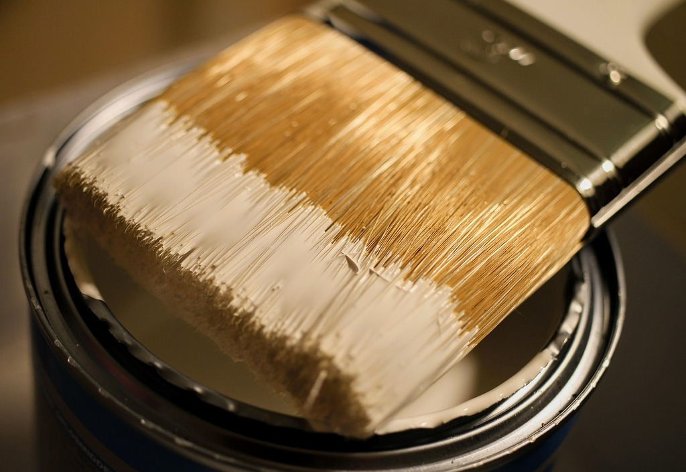
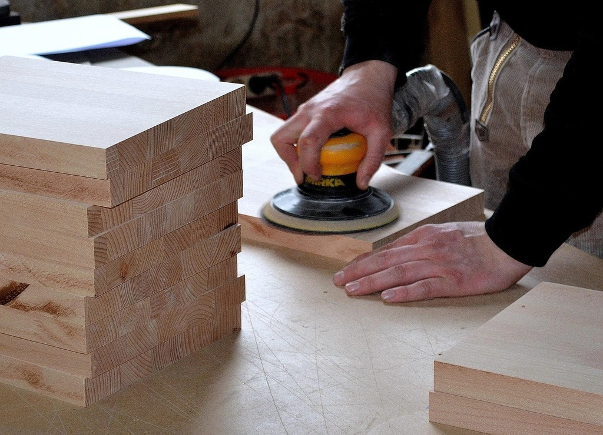

<!--

author:   Hilke Domsch
email:    hilke.domsch@gkz-ev.de
version:  0.0.3
language: de
narrator: Deutsch male

edit: true
date: 2025-09-15

icon: ../assets/img/Logo_234px.png
logo: ../assets/img/woodboard.jpg

attribute: title image Von Bundesarchiv, Bild 183-41030-0002 / Draum / CC-BY-SA 3.0, CC BY-SA 3.0 de, https://commons.wikimedia.org/w/index.php?curid=5428443

attribute: Oberflächenveredlung I TSO 1/2024, Oberflächenveredlung II TSO 2/2024, schwere Fragen

title: Oberflächenveredelung Tischlerhandwerk TSO 1+2/24
comment:  Schwere Fragen Oberflächengestaltung und Oberflächenbearbeitung Holz

link: ./style.css

import: https://raw.githubusercontent.com/Ifi-DiAgnostiK-Project/LiaScript_DragAndDrop_Template/refs/heads/main/README.md
        https://raw.githubusercontent.com/Ifi-DiAgnostiK-Project/Piktogramme/refs/heads/main/makros.md
        https://raw.githubusercontent.com/Ifi-DiAgnostiK-Project/Textilpflegesymbole/refs/heads/main/makros.md
        https://raw.githubusercontent.com/Ifi-DiAgnostiK-Project/LiaScript_ImageQuiz/refs/heads/main/README.md
        https://raw.githubusercontent.com/Ifi-DiAgnostiK-Project/Bildersammlung/refs/heads/main/makros.md

tags:   Oberflächenveredelung,
        Tischler,
        Schleifen,
        Ölen,
        Lacke

-->

# Oberflächenveredelung Tischlerhandwerk TSO 1+2/24
<!-- class="highlight" -->
Schwere Fragen
===

<!-- class="highlight; color: black" -->
Die Oberflächenbehandlung und -veredelung ist ein zentrales Thema im Tischler- und Schreinerhandwerk. Sie sorgt nicht nur für eine ansprechende Optik, sondern schützt Holzoberflächen auch dauerhaft vor Feuchtigkeit, Schmutz und Abnutzung.
   
Im Rahmen Ihrer Ausbildung haben Sie sich mit den wichtigsten Verfahren – vom Schleifen über das Beizen bis hin zum Lackieren, Ölen oder Wachsen – beschäftigt. Sie wissen, dass sowohl die Holzart, als auch die Nutzungsanforderungen und die gestalterischen Aspekte eine wesentliche Rolle spielen.
   
Die nachfolgenden Fragen dienen dazu, Ihr Wissen zu prüfen und zu festigen. Es soll Ihnen helfen, das Gelernte aktiv abzurufen und mit Freude in die praktische Arbeit einzubringen.

<!-- class="highlight" -->
Wir wünschen Ihnen viel Erfolg und Spaß beim Beantworten der Fragen!

 

<!-- style="max-width: 600px; width: 100%" -->

## Vorbereiten der Oberfläche - schwere Fragen

<section class="flex-container border">

<!-- class="highlight" -->
Warum ist das sorgfältige Entfernen von Schleifstaub vor dem Lackieren besonders wichtig?

<!-- data-randomize -->
- [( )] Schleifstaub fördert die Haftung.
- [(X)] Schleifstaub kann matte und raue Stellen entstehen lassen.
- [( )] Schleifstaub verzögert die Trocknung.
- [( )] Schleifstaub verändert den pH-Wert des Lacks.

<!-- style="max-width: 200px; width: 100%" -->

</section>

<section class="flex-container border">

<!-- class="highlight" -->
Welche Maßnahme verbessert die Haftung von wasserbasierten Lacken auf tropischen Hölzern (z. B. Teak)?

<!-- data-randomize -->
- [( )] Polieren
- [(X)] Zwischenschliff mit höherer Körnung und eventuell Primer
- [( )] Ölen der Oberfläche
- [( )] Trocknung bei hoher Luftfeuchtigkeit

</section>

## Beizen - schwere Fragen

<section class="flex-container border">

<!-- class="highlight" -->
Welche Voraussetzung ist zu erfüllen, damit eine chemische Beize richtig wirkt?

<!-- data-randomize -->
- [( )] Das Holz muss eine möglichst glatte Oberfläche haben.
- [(X)] Das Holz muss bestimmte Inhaltsstoffe (z. B. Gerbstoffe) enthalten.
- [( )] Die Beize muss unter UV-Licht trocknen.
- [( )] Die Poren müssen vollständig geschlossen sein.

 <!-- style="max-width: 300px; width: 100%" -->

</section>

<section class="flex-container border">

<!-- class="highlight" -->
Wie lässt sich eine fleckige Beizfläche auf Weichholz vermeiden?

<!-- data-randomize -->
- [( )] durch intensives Wässern
- [(X)] durch eine Nadelholz- oder Positivbeize
- [( )] durch eine dickschichtige Beize
- [( )] durch eine Heißlufttrocknung nach dem Beizen

>_Florian: Wenn weitere Bilder eingebracht werden sollen, dann bitte welche zur Verfügung stellen!_

</section>

## Überzugsmittel - schwere Fragen

<section class="flex-container border">

<!-- class="highlight" -->
Welcher Überzug eignet sich besonders gut für stark beanspruchte Flächen (z. B. Tischplatten)?\
Ziehen Sie den richtigen Begriff ins Antwortfeld.

<!-- data-randomize data-show-partial-solution -->
@dragdropmultiple(@uid,Zwei-Komponenten-PUR-Lacke,Schellack|Nitrocellulose-Lacke|Öle mit Naturharzanteil)

</section>

<section class="flex-container border">

<!-- class="highlight" -->
Welche Aussage über Naturöle als Oberflächenmittel ist korrekt?

<!-- data-randomize -->
- [( )] Naturöle bilden eine dicke, versiegende Lackschicht.
- [(X)] Naturöle dringen ins Holz ein und erhalten die Offenporigkeit.
- [( )] Naturöle sind nur für den Außenbereich geeignet.
- [( )] Naturöle benötigen keine Trocknungszeit.

<!-- style="max-width: 200px; width: 100%" -->

</section>

## Oberflächentechniken - schwere Fragen

<section class="flex-container border">

<!-- class="highlight" -->
Welche Folge kann ein zu feiner Zwischenschliff zwischen Lackschichten haben?

<!-- data-randomize -->
- [( )] Es wird eine schnellere Trocknung erreicht.
- [(X)] Daraus resultiert eine mangelnde Haftung bei der nächsten Lackschicht.
- [( )] Schleifspuren werden sichtbar.
- [( )] Es wird eine höhere Farbintensität erreicht.

 <!-- style="max-width: 300px; width: 100%" -->

</section>

<!-- style="max-width: 200px; width: 100%" -->

## Lackauftragsverfahren - schwere Fragen

<section class="flex-container border">

<!-- class="highlight" -->
Warum ist die Viskosität beim Spritzlackieren entscheidend?

<!-- data-randomize -->
- [( )] Sie beeinflusst die Farbwirkung.
- [(X)] Sie bestimmt das Spritzbild.
- [( )] Sie reguliert die Trocknungszeit.
- [( )] Sie macht eine Grundierung unnötig.

</section>

<!-- style="max-width: 200px; width: 100%" -->

## Trocknungs- und Härteverfahren - schwere Fragen

<section class="flex-container border">

<!-- class="highlight" -->
Wodurch unterscheiden sich UV-härtende Lacke von konventionellen Lacken?

<!-- data-randomize -->
- [( )] Sie sind essbar.
- [(X)] Sie härten durch Polymerisation unter UV-Strahlung.
- [( )] Sie enthalten Naturharze.
- [( )] Sie benötigen keine Vorbehandlung.

</section>

<!-- style="max-width: 300px; width: 100%" -->

## Sicherheit und Umweltschutz - schwere Fragen

<section class="flex-container border">

<!-- class="highlight" -->
Was ist bei der Lagerung von lösemittelhaltigen Produkten zu beachten?

<!-- data-randomize -->
- [( )] liegend lagern
- [(X)] auslaufsicher und in belüfteten Räumen
- [( )] Lagerung im Freien
- [( )] Lagerung unter Wasser

</section>

<!-- style="max-width: 500px; width: 100%" -->

## Geschafft! 🙌

