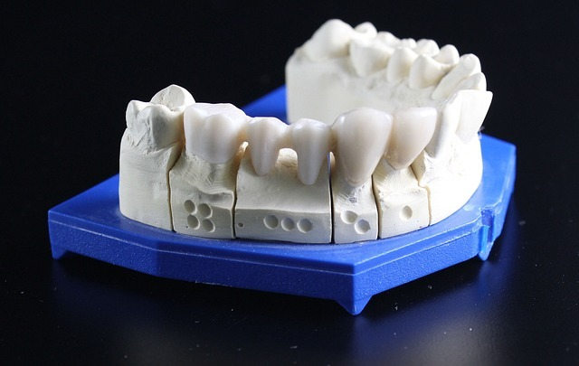
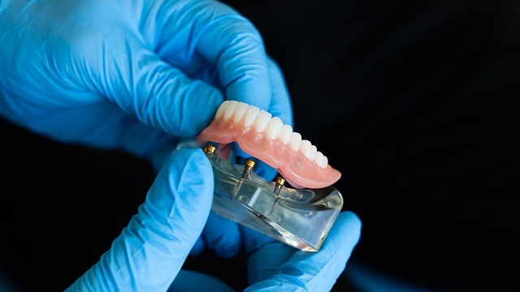
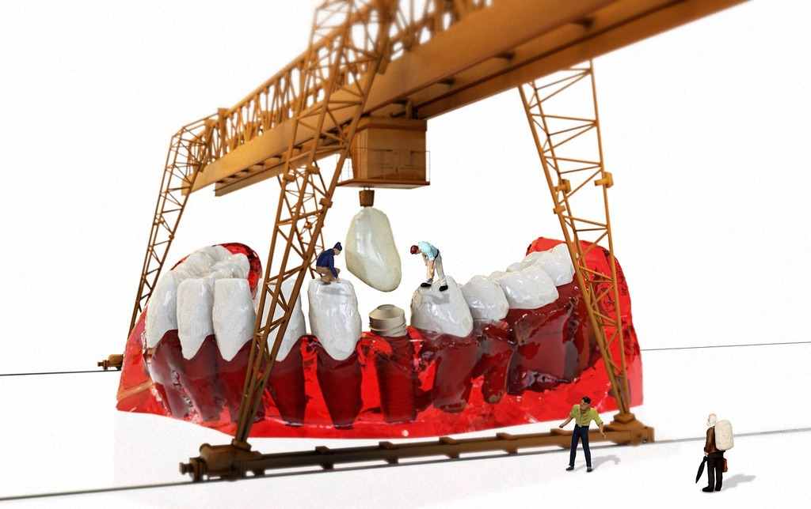
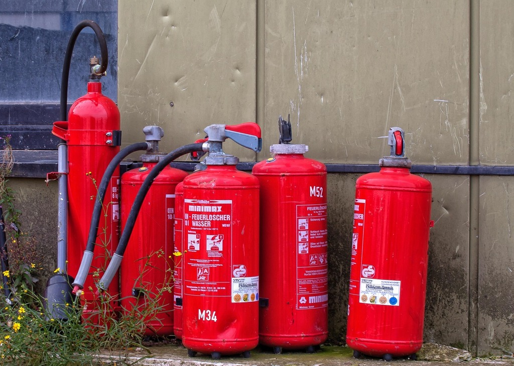

<!--

author: Hilke Domsch; Alexander Maywaldt

email:    hilke.domsch@gkz-ev.de

version: 0.0.4

language: de

narrator: Deutsch Female

edit: true
date: 2025-08-07

icon: ../assets/img/Logo_234px.png
logo: ../assets/img/unterkiefer_ansicht.jpg

title: Zahnersatz als partielle Prothese ZAHN 2-23
comment:  Kurs für Zahntechniker

link: ./style.css

import: https://raw.githubusercontent.com/Ifi-DiAgnostiK-Project/LiaScript_DragAndDrop_Template/refs/heads/main/README.md
        https://raw.githubusercontent.com/Ifi-DiAgnostiK-Project/Piktogramme/refs/heads/main/makros.md
        https://raw.githubusercontent.com/Ifi-DiAgnostiK-Project/Textilpflegesymbole/refs/heads/main/makros.md
        https://raw.githubusercontent.com/Ifi-DiAgnostiK-Project/LiaScript_ImageQuiz/refs/heads/main/README.md
        https://raw.githubusercontent.com/Ifi-DiAgnostiK-Project/Bildersammlung/refs/heads/main/makros.md

tags:  Zahntechniker,
       Zahnersatz,
       Prothese,
       Zahnprothese

-->

# Herausnehmbaren definierten Zahnersatz als partielle Prothese herstellen (ZAHN 2-23)

Sie haben in den letzten Tagen den Herstellungsprozess sowie die Arbeits- und Hilfsmittel für das Herstellen von partiellem Zahnersatz kennengelernt.     __Überprüfen Sie Ihr Wissen.__

<!--style="color:red"-->Hinweis: Es können mehrere Antworten richtig sein.

---------------

<!-- style="width: 700px" -->

_Quelle: Pixabay, dental-inno_

<!--style="color:blue; font-weight: bolder; font-size: large"-->Viel Erfolg!

## 1. Biokompatible Materialien in der Zahntechnik

Biokompatible Materialien in der Zahntechnik sind besonders wichtig, weil sie im Mund langzeitig mit Gewebe und Schleimhaut in Kontakt stehen.   Sie müssen gut verträglich sein, keine Allergien auslösen und biologisch „neutral“ bleiben.

----------------

<!--style="color: blue; font-weight: bolder"-->Welches Material zählt zu den biokompatiblen Werkstoffen in der Zahntechnik?

<!--style="color: blue"-->Ziehe die richtigen Antworten in das Feld.

<!--style="color:red; font-size: huge"-->Hinweis: Erst nachdem alle richtigen Begriffe ins Antwortfeld gezogen worden sind, gibt es ein grünes Häckchen! 😄

<!-- data-randomize -->
@dragdropmultiple(@uid,Titan|Goldlegierungen|PEEK|Vollkeramik|Zirkonoxid,Nickel|Blei|Quecksilber|Amalgan)

<section class="flex-container border">

<!--style="color: blue; font-weight: bolder"-->Welches Material wird häufig für Kronen und Brücken verwendet?

<!--style="color:red;"-->Hinweis: Es sind mehrere Antworten richtig.

<!-- data-randomize -->
- [[ ]] Kunststoff
- [[X]] Zirkonoxid
- [[ ]] Amalgan
- [[ ]] Biomaterialien
- [[X]] CoCr

<!-- style="max-width: 300px; width: 100%" -->

</section>

<section class="flex-container border">

<!--style="color: blue; font-weight: bolder"-->Welches Material ist ideal für Implantate?

<!-- data-randomize -->
- [( )] Kunststoff
- [( )] Keramik
- [( )] Amalgan
- [( )] Kupfer
- [(X)] Titan

</section>

## 2. Schmelzverfahren in der Zahntechnik

<!--style="color: blue; font-weight: bolder"-->Entscheiden Sie, welche Aussagen zu welchem Schmelzverfahren gehören.\
Klicken Sie in der "Auswahl" das richtige Verfahren an.

-----

Bei diesem Verfahren wird ein elektrischer Widerstand genutzt.   Es eignet sich sehr gut für die Schmelze von Metallen in speziellen Tiegeln.   Die Wärme verteilt sich gleichmäßig.

<!-- data-randomize -->
[[Plasmaschmelzverfahren  | Elektronenschmelzververfahren | (Widerstandsschmelzverfahren) | Induktionsschmelzverfahren | Flammschmelzen ]]

-----

Bei diesem Verfahren wird ein Brenngas, meist Acetylen oder Propan, verwendet.   Es eignet sich gut für das Schmelzen von Edelmetallen wie Gold.   Das Verfahren ist für kleine Schmelzmengen gut geeignet.

<!-- data-randomize -->
[[Elektronenschmelzverfahren | Pressschmelzverfahren | Widerstandsschmelzverfahren | Induktionsschmelzverfahren | (Flammschmelzen) ]]

-----------

Bei diesem Verfahren wird eine Spule erwärmt, die das zu schmelzende Material erhitzt, ohne direkten Kontakt.   Es wird oft für Edelmetalle und Legierungen verwendet.   Das Verfahren ist sehr schnell, effizient und bietet eine präzise Temperaturkontrolle.

<!-- data-randomize -->
[[(Induktionsschmelzverfahren) | Plasmaschmelzverfahren | Widerstandsschmelzverfahren | Lichtbogenschmelzverfahren | Elektronenstrahlschmelzen ]]

-----------

Bei diesem Verfahren wird im Zusammenspiel von zwei Elektroden eine extrem hohe Temperatur erzeugt.   Primär wird dieses Verfahren bei der Herstellung von speziellen Legierungen und für Titanlegierungen eingesetzt.   Es eignet sich für große Mengen an Material, besitzt eine hohe Schmelzgeschwindigkeit und Effizienz.

<!-- data-randomize -->
[[Elektronenschmelzverfahren | (Lichtbogenschmelzen) | Plasmaschmelzen | Induktionsschmelzverfahren | Flammschmelzen ]]

## 3. Fügetechniken in der Zahntechnik

<!--style="color: blue; font-weight: bolder"-->Ziehe die richtigen Antworten in das Feld.

<!--style="color:red; font-size: huge"-->Hinweis: Erst nachdem alle richtigen Begriffe ins Antwortfeld gezogen worden sind, gibt es ein grünes Häckchen! 😄

<!-- data-randomize -->
@dragdropmultiple(@uid,Löten|Kleben|Laserschweißen|Phaser,Umformen|Mechanisches Fügen|Einpressen|Reibungsschweißen)

<section class="flex-container border">

<!--class="highlight"-->
Ziehe die passenden Begriffe in das entsprechende Feld.

Fügen<!--style="color: green; font-weight: bolder"--> meint  [->[  (lösbare) | lockere ]] oder [->[  feste | (unlösbare) ]] Verbindungen.

In der Zahntechnik unterscheidet man verschiedene Verbindungen. Eine davon sind die [->[  (stoffschlüssige) | materialschlüssige ]] Verbindungen.

</section>

<section class="flex-container border">

<!--class="highlight"-->
Welche Verbindungsarten in der zahntechnischen Anwendungen sind richtig benannt?

<!--style="color:red;"-->Hinweis: Es sind mehrere Antworten richtig.

<!-- data-randomize -->
- [[ ]] hybride Verbindung
- [[X]] formschlüssige Verbindung
- [[ ]] sensible Verbindung
- [[X]] kraftschlüssige Verbindung

<!-- style="max-width: 300px; width: 100%" -->

</section>

### 3.1 Löten

<section class="flex-container border">

<!--style="color: blue; font-weight: bolder"-->Welche Aussagen zum ~~Löten~~ in der Zahntechnik sind korrekt?

<!--style="color:red;"-->Hinweis: Es sind mehrere Antworten richtig.

<!-- data-randomize -->
- [[ ]] Es erfolgt bei Temperaturen über 1.200 °C.
- [[X]] Es wird eine Lötlegierung verwendet, die einen niedrigeren Schmelzpunkt hat als das Grundmaterial.
- [[ ]] Die miteinander zu verbindenden Teile müssen aufgrund der Schmelztemperatur nicht gereinigt werden.
- [[X]] Es wird ein Flussmittel eingesetzt, um eine Oxidbildung zu verhindern.

</section>

<section class="flex-container border">

<!--class="highlight"-->
Ziehe die passenden Begriffe in das entsprechende Feld.

In der Zahntechnik<!--style="color: green; font-weight: bolder"--> wird nur  [->[  (Hartlöten) | Punktlöten ]] eingesetzt.

Die Festigkeitswerte<!--style="color: green; font-weight: bolder"--> der Lotnaht ist [->[  (geringer) | höher ]] als bei einer Schweißnaht.

</section>

<section class="flex-container border">

<!--class="highlight"-->
Welche Lote werden in der Zahntechnik unterschieden?

<!--style="color:red;"-->Hinweis: Es sind mehrere Antworten richtig.

<!-- data-randomize -->
- [[ ]] Vorlote
- [[X]] Hauptlote
- [[ ]] Feinlote
- [[X]] Reparaturlote

<!-- style="max-width: 200px; width: 100%" -->

</section>

### 3.2 Kleben

<section class="flex-container border">

<!--style="color: blue; font-weight: bolder"-->Welche Aussagen zum ~~Kleben~~ in der Zahntechnik sind korrekt?

<!--style="color:red;"-->Hinweis: Es sind mehrere Antworten richtig.

<!-- data-randomize -->
- [[ ]] Es ist besonders hitzebeständig bei hohen Temperaturen.
- [[X]] Es ist geeignet für unterschiedliche Materialkombinationen.
- [[ ]] Es erfordert immer zusätzliche Metallverbindungen.
- [[X]] Belastungen können elastisch verteilt werden.

</section>

<section class="flex-container border">

<!--style="color: blue; font-weight: bolder"-->Welche Bedingungen sind wichtig, damit eine Klebeverbindung in der Zahntechnik dauerhaft hält?

<!--style="color:red;"-->Hinweis: Es sind mehrere Antworten richtig.

<!-- data-randomize -->
- [[ ]] Unebenheiten verbessern die Haftung.
- [[X]] Saubere und fettfreie Oberflächen sind notwendig.
- [[ ]] Durch die innovativen Klebemittel ist keine Trocknungs- oder Aushärtungszeit notwendig.
- [[X]] Für das jeweilige Material ist ein geeigneter Klebstoff auszuwählen.

<!-- style="max-width: 200px; width: 100%" -->

</section>

<!--style="color: blue; font-weight: bolder"-->Welche Begriffe im Zusammenhang mit ~~Klebetechnik in der Zahntechnik~~ sind korrekt?\
Ziehe die richtigen Antworten in das Feld.

<!--style="color:red; font-size: huge"-->Hinweis: Erst nachdem alle richtigen Begriffe ins Antwortfeld gezogen worden sind, gibt es ein grünes Häckchen! 😄

<!-- data-randomize -->
@dragdropmultiple(@uid,Adhäsion|Kohäsion,Adaption|Fusion)

### 3.3 Laserschweißen

<section class="flex-container border">

<!--style="color: blue; font-weight: bolder"-->Welche Aussagen zum ~~Laserschweißen~~ in der Zahntechnik sind korrekt?

<!--style="color:red;"-->Hinweis: Es sind mehrere Antworten richtig.

<!-- data-randomize -->
- [[ ]] Es benötigt immer zusätzliche Lötlegierungen.
- [[X]] Es ermöglicht eine punktgenaue Energieerbringung.
- [[ ]] Es ist ausschließlich für Kunststoffe geeignet.
- [[X]] Das umliegende Material wird nur gering thermisch belastet.

</section>

<section class="flex-container border">

<!--style="color: blue; font-weight: bolder"-->Für welche Zwecke wird das Laserschweißen in der Zahntechnik eingesetzt?

<!--style="color:red;"-->Hinweis: Es sind mehrere Antworten richtig.

<!-- data-randomize -->
- [[ ]] Zum Verbinden von Keramik mit Kunststoff.
- [[X]] Für die Reparatur von Rissen und Brüchen in Metallgerüsten.
- [[ ]] Für das Verkleben von Kronen und Brücken.
- [[X]] Zum punktgenauen Schweißen kleiner Metallbereiche.

<!-- style="max-width: 300px; width: 100%" -->

</section>

<!--style="color: blue; font-weight: bolder"-->Welche Begriffe gehören zum ~~Verfahren des Laserschweißens~~?\
Ziehe die richtigen Antworten in das Feld.

<!--style="color:red; font-size: huge"-->Hinweis: Erst nachdem alle richtigen Begriffe ins Antwortfeld gezogen worden sind, gibt es ein grünes Häckchen! 😄

<!-- data-randomize -->
@dragdropmultiple(@uid,Laserpuls|Wärmeeinflusszone,Lichtbogenphase|Photonenschmelze)

### 3.4 Phaser-Technik

<section class="flex-container border">

<!--class="highlight"-->
Ziehe die passenden Begriffe in das entsprechende Feld.

Ein anderer Begriff für Phaser-Technik<!--style="color: green; font-weight: bolder"--> ist  [->[  (Plasma-Lichtbogenschweißen) | Photonenschweißen ]].

Die Festigkeitswerte<!--style="color: green; font-weight: bolder"--> der Lotnaht ist [->[  (geringer) | höher ]] als bei einer Schweißnaht.

</section>

<section class="flex-container border">

<!--style="color: blue; font-weight: bolder"-->Welche Aussagen zum ~~Phaser-Technik~~ in der Zahntechnik sind korrekt?

<!--style="color:red;"-->Hinweis: Es sind mehrere Antworten richtig.

<!-- data-randomize -->
- [[ ]] Es ist besonders hitzebeständig bei hohen Temperaturen.
- [[X]] Es ist geeignet für unterschiedliche Materialkombinationen.
- [[ ]] Es erfordert immer zusätzliche Metallverbindungen.
- [[X]] Belastungen können elastisch verteilt werden.

</section>

<!--style="color: blue; font-weight: bolder"-->Welche Begriffe im Zusammenhang mit der ~~Phaser-Technik~~ sind korrekt?\
Ziehe die richtigen Antworten in das Feld.

<!--style="color:red; font-size: huge"-->Hinweis: Erst nachdem alle richtigen Begriffe ins Antwortfeld gezogen worden sind, gibt es ein grünes Häckchen! 😄

<!-- data-randomize -->
@dragdropmultiple(@uid,Plasmateilchen|Inertgas,Phasor-Technik|Photonenschweißen)

## 4. Gase im Zahntechniklabor

>_Acetylen wird von den HWK-Ausbildern als falsche Antwort angegeben. In den Lernkarten Zahntechniker kommt eine Frage zur Gasentnahme von Acetylen vor?! HWK: Bitte prüfen!_

<section class="flex-container border">

<!--style="color: blue; font-weight: bolder"-->Welche Gasarten können in einem Zahntechniklabor zum Einsatz kommen?

<!--style="color:red;"-->Hinweis: Es sind mehrere Antworten richtig.

<!-- data-randomize -->
- [[ ]] Acetylen
- [[X]] Argon
- [[ ]] Stickstoff
- [[X]] Propan
- [[ ]] Kohlendioxid
- [[X]] Butan
- [[X]] Sauerstoff

<!-- style="max-width: 300px; width: 100%" -->

</section>

<section class="flex-container border">

<!--style="color: blue; font-weight: bolder"-->Welche Aussagen zum Einsatz von Gasen im Zahntechniklabor sind korrekt?

<!--style="color:red;"-->Hinweis: Es sind mehrere Antworten richtig.

<!-- data-randomize -->
- [[ ]] Acetylen gehört zu den Standardgasen im Zahntechniklabor.
- [[X]] Sauerstoff wird häufig als Reaktionspartner für Flammen oder im Schweißprozess eingesetzt.
- [[ ]] Stickstoff ist ein typisches Prozessgas in der Zahntechnik.
- [[X]] Argon wird als Schutzgas beim Laserschweißen eingesetzt.
- [[ ]] Kohlendioxid wird regelmäßig im Dentallabor verwendet.

</section>

<!--style="color: blue; font-weight: bolder"-->Welche Begriffe sind im Kontext des Zahntechniklabors korrekt?\
Ziehe die richtigen Antworten in das Feld.

<!--style="color:red; font-size: huge"-->Hinweis: Erst nachdem alle richtigen Begriffe ins Antwortfeld gezogen worden sind, gibt es ein grünes Häckchen! 😄

<!-- data-randomize -->
@dragdropmultiple(@uid,Schutzgas Argon|Sauerstoff,Acetylen|Kohlendioxid|Stickstoff)

### 4.1 Gase, Arbeitsschutz & Sicherheit im Zahntechniklabor

<section class="flex-container border">

<!--style="color: blue; font-weight: bolder"-->Welche Arbeitsschutzmaßnahmen beim Umgang mit Gasen sind verpflichtend?

<!--style="color:red;"-->Hinweis: Es sind mehrere Antworten richtig.

<!-- data-randomize -->
- [[ ]] Lagern von Gasflaschen im Freien ist erlaubt.
- [[X]] Schläuche und Anschlüsse sind regelmäßig auf Dichtigkeit zu prüfen.
- [[ ]] Gasflaschen dürfen in einem Arbeitsraum offen gelagert werden.
- [[X]] Gasflaschen sind gegen Umfallen zu sichern.

</section>

<section class="flex-container border">

<!--style="color: blue; font-weight: bolder"-->Welche Teile gehören zur Persönlichen Schutzausrüstung (PSA)?

<!--style="color:red;"-->Hinweis: Es sind mehrere Antworten richtig.

<!-- data-randomize -->
- [[ ]] Kopfbedeckung 🧢
- [[X]] Schutzbrille 👓
- [[X]] Schutzhandschuhe 🧤
- [[X]] Laborkittel oder geeignete Arbeitskleidung 🥼

</section>

### 4.2 Gase, Arbeitsschutz & Sicherheit im Zahntechniklabor

<section class="flex-container border">

<!--style="color: blue; font-weight: bolder"-->Sicherheit im Laboralltag - Welche Regeln sind verbindlich?

<!--style="color:red;"-->Hinweis: Es sind mehrere Antworten richtig.

<!-- data-randomize -->
- [[ ]] Schutzbrille ist nur bei Laserarbeiten notwendig.
- [[ ]] Wenn Gasgeräte gut gesichert und außerhalb von brennbaren Stoffen betrieben werden, können sie auch unbeaufsichtigt laufen.
- [[X]] Wird mit Chemikalien gearbeitet, ist ein Abzug oder ausreichende Belüftung notwendig.
- [[X]] Gasflaschen sind nach der Arbeit sofort zu schließen.

</section>

<section class="flex-container border">

<!--style="color: blue; font-weight: bolder"-->Welche Aussagen zum Einsatz von Gasen im Zahntechniklabor sind korrekt?

<!--style="color:red;"-->Hinweis: Es sind mehrere Antworten richtig.

<!-- data-randomize -->
- [[ ]] Acetylen gehört zu den Standardgasen im Zahntechniklabor.
- [[X]] Sauerstoff wird häufig als Reaktionspartner für Flammen oder im Schweißprozess eingesetzt.
- [[ ]] Stickstoff ist ein typisches Prozessgas in der Zahntechnik.
- [[X]] Argon wird als Schutzgas beim Laserschweißen eingesetzt.
- [[ ]] Kohlendioxid wird regelmäßig im Dentallabor verwendet.

<!-- style="max-width: 300px; width: 100%" -->

</section>

## Geschafft! 🙌

